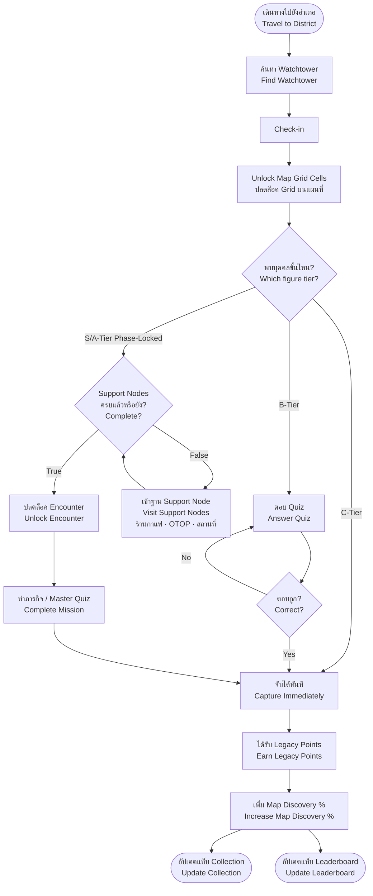
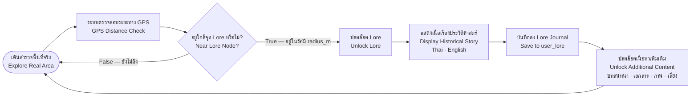
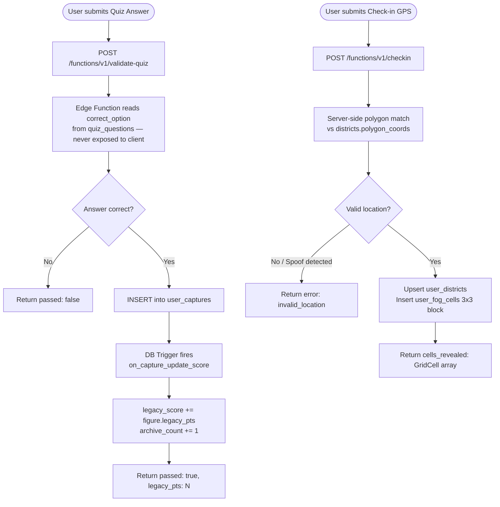

# Tamroi — Production Refactor Report

> Based on current codebase (`PROJECT_SUMMARY.md` · NSC 2026 · Team ปลามึกยักษ์)
> Generated: 2026-06-14

---

## Table of Contents

1. [Core Problems with the Current Setup](#1-core-problems)
2. [Recommended Production Stack](#2-recommended-production-stack)
3. [Technology Decision Table](#3-technology-decision-table)
4. [Project Structure (Target)](#4-project-structure-target)
5. [Credentials & Secrets Management](#5-credentials--secrets-management)
6. [What to Keep Exactly As-Is](#6-what-to-keep-exactly-as-is)
7. [Critical Security Fix — Server-Side Validation](#7-critical-security-fix)
8. [Map Grid System — Thailand Fog of War](#8-map-grid-system--thailand-fog-of-war)
9. [Game Logic Flowcharts](#9-game-logic-flowcharts)
10. [Full Database Seed — All Tables](#10-full-database-seed--all-tables)
11. [Migration Order](#11-migration-order)
12. [Estimated Timeline](#12-estimated-timeline)

---

## 1. Core Problems

The codebase is built on "Vanilla JS IIFE module objects on `window.*`" — which works for a hackathon but becomes painful to scale because:

- **No type safety** — bugs in `supabase-client.js` are invisible until runtime
- **Global coupling** — `window.DB`, `window.MapModule`, `window.AppCore` are tightly coupled, making any refactor risky
- **No component model** — UI state is scattered across HTML + JS with `display:none` tab-switching
- **Fake build step** — the `build.js` env injector is not a real bundler (no tree-shaking, no code splitting)
- **No real tests** — the test suite is a static file scanner, not actual unit or integration tests
- **Client-side quiz validation** — anyone can open DevTools and pass any quiz without answering
- **Hardcoded district data in `map.js`** — coordinates should live in Supabase, not the frontend

---

## 2. Recommended Production Stack

### Frontend — Next.js (React) + TypeScript

Next.js App Router is the right choice for Tamroi specifically because:

- File-based routing replaces the manual tab-switching logic in `app.html`
- React's component model isolates map, collection, leaderboard, and quiz UI into independent units with their own state
- TypeScript catches the entire class of runtime bugs from passing wrong shapes into Supabase queries
- Next.js + Vercel is a first-class pairing — zero extra infrastructure cost since the app is already on Vercel

Keep **Leaflet.js** via `react-leaflet`, which wraps it cleanly with no loss of capability.

### Backend — Supabase (keep, but use it fully)

The database schema and triggers are well-designed and should be kept. What changes:

- Move quiz answer validation to a **Supabase Edge Function** — currently validated client-side
- Move GPS check-in validation to an **Edge Function** for spoof detection
- Replace the four hand-written `patch_*.sql` files with **Supabase CLI migrations**
- **Remove the artifacts system entirely** — drop `artifacts` and `user_artifacts` tables

---

## 3. Technology Decision Table

| Layer | Current | Production | Reason |
|---|---|---|---|
| UI framework | Vanilla JS + Bootstrap 5 | **Next.js 14 + React** | Component model, proper routing, isolated state |
| Language | JavaScript (no types) | **TypeScript** | Compile-time safety; Supabase auto-generates DB types |
| CSS | Custom vars + Bootstrap | **Tailwind CSS + shadcn/ui** | Maps 1:1 to existing token system, no Bootstrap conflicts |
| Map | Leaflet.js (imperative DOM) | **react-leaflet** | Same Leaflet engine, React-integrated, no manual DOM calls |
| Global state | `window.*` objects | **Zustand** | Shared state without prop drilling, no Redux overhead |
| Server logic | Client-side JS | **Supabase Edge Functions** | Quiz validation and check-in must not run on the client |
| DB migrations | Manual `patch_*.sql` files | **Supabase CLI migrations** | Versioned, team-friendly, rollbackable |
| Build tooling | Hand-written `build.js` | **Next.js built-in** | Real bundler — tree-shaking, code splitting, env handling |
| Testing | Static file scanner | **Vitest + Playwright** | Actual unit tests and end-to-end browser tests |
| i18n | Thai-only UI | **next-intl** | Switchable Thai / English at runtime |
| Map fog | Province-shaped GeoJSON polygon | **1×1 km uniform grid cells** | Consistent reveal area, more game-like, better visibility |

---

## 4. Project Structure (Target)

```
tamroi/
├── apps/
│   └── web/                              ← Next.js 14 (App Router)
│       ├── app/
│       │   ├── (auth)/
│       │   │   ├── login/page.tsx
│       │   │   └── register/page.tsx
│       │   ├── onboarding/page.tsx
│       │   ├── app/
│       │   │   ├── layout.tsx            ← shell: top bar + bottom nav
│       │   │   ├── map/page.tsx
│       │   │   ├── collection/page.tsx
│       │   │   ├── missions/page.tsx
│       │   │   └── leaderboard/page.tsx
│       │   └── page.tsx                  ← splash / landing
│       ├── components/
│       │   ├── map/
│       │   │   ├── TamroiMap.tsx         ← react-leaflet wrapper
│       │   │   ├── GridFogLayer.tsx      ← 1×1 km grid fog cells
│       │   │   └── FigureMarker.tsx
│       │   ├── capture/
│       │   │   ├── QuizModal.tsx
│       │   │   └── CaptureResult.tsx
│       │   ├── lore/
│       │   │   └── LoreSheet.tsx
│       │   └── ui/                       ← shadcn/ui primitives
│       ├── lib/
│       │   ├── supabase/
│       │   │   ├── client.ts             ← browser Supabase client
│       │   │   └── server.ts             ← server-side client (RSC / Edge)
│       │   ├── geo/
│       │   │   ├── haversine.ts          ← ported from map.js
│       │   │   ├── grid.ts               ← 1×1 km grid cell generation
│       │   │   └── polygon.ts
│       │   ├── i18n/
│       │   │   ├── th.json               ← Thai strings
│       │   │   └── en.json               ← English strings
│       │   └── types/
│       │       └── database.types.ts     ← auto-generated by Supabase CLI
│       └── hooks/
│           ├── useGeolocation.ts
│           ├── useDistrict.ts
│           ├── useLanguage.ts            ← Thai/English toggle
│           └── useCaptureLoop.ts
│
├── supabase/
│   ├── functions/
│   │   ├── validate-quiz/               ← Edge Function: server-side answer check
│   │   └── checkin/                     ← Edge Function: GPS + spoof detection
│   └── migrations/                      ← replaces schema.sql + patch_*.sql
│
└── packages/
    └── shared-types/                    ← shared TS types for future mobile app
```

---

## 5. Credentials & Secrets Management

### Local Development — `.env.local`

Create this file at the project root. **Never commit it to git.**

```bash
# .env.local  ← git-ignored, local dev only
NEXT_PUBLIC_SUPABASE_URL=https://lnvpolwznueiklfgycei.supabase.co
NEXT_PUBLIC_SUPABASE_ANON_KEY=your_anon_key_here

# Never expose these to the client — server/Edge Functions only
SUPABASE_SERVICE_ROLE_KEY=your_service_role_key_here
```

Add `.env.local` to `.gitignore`:

```gitignore
# .gitignore
.env.local
.env.*.local
```

### Template for teammates — `.env.example`

Commit this file to git so teammates know what variables are needed:

```bash
# .env.example  ← commit this, not .env.local
NEXT_PUBLIC_SUPABASE_URL=
NEXT_PUBLIC_SUPABASE_ANON_KEY=
SUPABASE_SERVICE_ROLE_KEY=
```

### Vercel Production

Set variables in **Vercel Dashboard → Project → Settings → Environment Variables**:

| Variable | Value | Exposed to Browser |
|---|---|---|
| `NEXT_PUBLIC_SUPABASE_URL` | your Supabase project URL | ✅ Yes (safe — public) |
| `NEXT_PUBLIC_SUPABASE_ANON_KEY` | your anon key | ✅ Yes (safe — RLS enforced) |
| `SUPABASE_SERVICE_ROLE_KEY` | your service role key | ❌ No — server/Edge only |

### Rules

- `NEXT_PUBLIC_*` prefix = exposed to browser bundle. Only use for anon key + URL.
- `SUPABASE_SERVICE_ROLE_KEY` must **never** have the `NEXT_PUBLIC_` prefix. It bypasses RLS and must only run in Edge Functions or server-side code.
- The current `js/env.js` approach (a tracked JS file with real keys) should be replaced entirely with Next.js env handling. Delete `js/env.js` and `js/env.example.js`.
- Rotate keys immediately if `SUPABASE_SERVICE_ROLE_KEY` is ever accidentally pushed to git.

---

## 6. What to Keep Exactly As-Is

These are already correct and should be migrated unchanged:

- **PostgreSQL schema** — tables are well-designed; migrate directly (minus `artifacts` and `user_artifacts` which are dropped)
- **DB triggers** — `on_capture_update_score` and `on_auth_user_created` are correct; keep them
- **RLS policies** — all policies are sound; carry them over verbatim
- **`haversineDistance()` logic** — just move it to `lib/geo/haversine.ts` and add types
- **Design tokens** — `variables.css` color system maps 1:1 to Tailwind CSS variables; the values stay the same
- **`increment_node_visit()` RPC** — idempotent, correct, keep it
- **`increment_legacy_score()` RPC** — keep it, used by lore unlock

---

## 7. Critical Security Fix

### Quiz Validation (currently broken)

Quiz answers are currently validated **client-side** in `map.js`. This means any user can open DevTools, inspect the quiz question object, and pass any quiz without answering correctly.

**Fix — Supabase Edge Function `validate-quiz`:**

```
User submits answer
  → POST /functions/v1/validate-quiz  { figure_id, district_id, question_id, answer }
  → Edge Function reads correct_option from quiz_questions (never sent to client)
  → If correct: inserts row into user_captures → DB trigger fires → legacy_score updates
  → Returns { passed: true/false, legacy_pts: number } to client
```

The correct answer never leaves the server.

### Check-in Validation (GPS spoof detection)

GPS coordinates should be verified server-side:

```
User submits check-in
  → POST /functions/v1/checkin  { lat, lng, district_id }
  → Edge Function performs polygon matching against districts.polygon_coords
  → Checks movement speed vs last check-in (flag if > 200 km/h = likely spoof)
  → If valid: upserts user_districts, inserts user_fog_cells 3×3 block
  → Returns { success: true, cells_revealed: GridCell[] }
```

---

## 8. Map Grid System — Thailand Fog of War

### Why Grid Instead of Province Polygons

The current fog uses province-shaped GeoJSON polygons which reveal the entire province at once. A **1×1 km uniform grid** is more game-like: players reveal small cells as they physically move, making fog feel alive and rewarding small movements.

### How Grid Cells Work

Each cell is identified by a `(row, col)` integer pair derived from GPS coordinates:

```typescript
// lib/geo/grid.ts
const CELL_SIZE_DEG = 0.009; // ≈ 1 km at Thailand's latitude

export function latLngToCell(lat: number, lng: number): { row: number; col: number } {
  return {
    row: Math.floor(lat / CELL_SIZE_DEG),
    col: Math.floor(lng / CELL_SIZE_DEG),
  };
}

export function cellToLatLngBounds(row: number, col: number) {
  return {
    south: row * CELL_SIZE_DEG,
    north: (row + 1) * CELL_SIZE_DEG,
    west: col * CELL_SIZE_DEG,
    east: (col + 1) * CELL_SIZE_DEG,
  };
}
```

### Reveal Rules

| Event | Cells Revealed |
|---|---|
| Check-in at Watchtower | 3×3 grid (9 cells ≈ 3×3 km) centered on watchtower |
| Visit Support Node | 1×1 cell (the cell the user is in) |
| Standard GPS movement | 1×1 cell (current position cell) |

### Large Landmarks (multi-cell)

For large sites like the Grand Palace complex (~0.5 km²), the watchtower check-in reveals a 3×3 = 9-cell block, covering the entire grounds and nearby streets.

### Database — `user_fog_cells` Table

```sql
CREATE TABLE user_fog_cells (
  user_id   UUID REFERENCES auth.users(id) ON DELETE CASCADE,
  cell_row  INT  NOT NULL,
  cell_col  INT  NOT NULL,
  revealed_at TIMESTAMPTZ DEFAULT now(),
  PRIMARY KEY (user_id, cell_row, cell_col)
);
ALTER TABLE user_fog_cells ENABLE ROW LEVEL SECURITY;
CREATE POLICY "own cells only" ON user_fog_cells
  FOR ALL USING (auth.uid() = user_id);
```

### Frontend — `GridFogLayer.tsx`

```typescript
// components/map/GridFogLayer.tsx
// Thailand bbox: lat 5.5–20.5, lng 97.5–105.7
// Render dark Rectangle for every unrevealed cell in the current viewport
// Only fetch cells near the user viewport + buffer to avoid loading all cells
// Use Leaflet Rectangle layer per cell, toggled by user_fog_cells membership
import { Rectangle } from 'react-leaflet';
import { cellToLatLngBounds } from '@/lib/geo/grid';
```

---

## 9. Game Logic Flowcharts

### 9.1 Main Capture Loop



### 9.2 Lore Unlock Loop



### 9.3 Server-Side Validation Flow



---

## 10. Full Database Seed — All Tables

> Run in this order in Supabase SQL Editor.
> All coordinates are real GPS coordinates from Wikipedia, Google Maps, and official Thai records.
> Figures spread across 12 Bangkok districts. Grand Palace (Rattanakosin) has the most detailed lore and support nodes.
> Artifacts table is **dropped** — run section 10.0 first.

---

### 10.0 Schema Changes

```sql
-- Drop artifacts (no longer used)
DROP TABLE IF EXISTS user_artifacts CASCADE;
DROP TABLE IF EXISTS artifacts CASCADE;

-- Add grid-based fog cells table
CREATE TABLE IF NOT EXISTS user_fog_cells (
  user_id     UUID REFERENCES auth.users(id) ON DELETE CASCADE,
  cell_row    INT  NOT NULL,
  cell_col    INT  NOT NULL,
  revealed_at TIMESTAMPTZ DEFAULT now(),
  PRIMARY KEY (user_id, cell_row, cell_col)
);
ALTER TABLE user_fog_cells ENABLE ROW LEVEL SECURITY;
CREATE POLICY "own fog cells" ON user_fog_cells
  FOR ALL USING (auth.uid() = user_id);
```

---

### 10.1 Districts (12 Bangkok Districts — Real Coordinates)

```sql
TRUNCATE TABLE districts CASCADE;

INSERT INTO districts (id, name_th, name_en, province, center_lat, center_lng,
  watchtower_lat, watchtower_lng, required_cafes, required_otops, required_landmarks,
  polygon_coords, is_active)
VALUES
('rattanakosin','พระนคร','Rattanakosin','Bangkok',
  13.7501,100.4921,13.7500,100.4913,2,1,3,
  '{"type":"Polygon","coordinates":[[[100.485,13.742],[100.500,13.742],[100.500,13.760],[100.485,13.760],[100.485,13.742]]]}',true),
('silom','บางรัก/สีลม','Silom','Bangkok',
  13.7246,100.5234,13.7283,100.5268,2,1,3,
  '{"type":"Polygon","coordinates":[[[100.515,13.718],[100.535,13.718],[100.535,13.732],[100.515,13.732],[100.515,13.718]]]}',true),
('sukhumvit','สุขุมวิท','Sukhumvit','Bangkok',
  13.7400,100.5697,13.7445,100.5605,2,1,3,
  '{"type":"Polygon","coordinates":[[[100.555,13.730],[100.590,13.730],[100.590,13.755],[100.555,13.755],[100.555,13.730]]]}',true),
('chatuchak','จตุจักร','Chatuchak','Bangkok',
  13.7997,100.5500,13.7997,100.5500,2,1,3,
  '{"type":"Polygon","coordinates":[[[100.540,13.790],[100.560,13.790],[100.560,13.810],[100.540,13.810],[100.540,13.790]]]}',true),
('ladphrao','ลาดพร้าว','Lat Phrao','Bangkok',
  13.8136,100.5765,13.8136,100.5765,2,1,3,
  '{"type":"Polygon","coordinates":[[[100.565,13.800],[100.590,13.800],[100.590,13.830],[100.565,13.830],[100.565,13.800]]]}',true),
('dusit','ดุสิต','Dusit','Bangkok',
  13.7766,100.5206,13.7716,100.5132,2,1,3,
  '{"type":"Polygon","coordinates":[[[100.510,13.765],[100.535,13.765],[100.535,13.790],[100.510,13.790],[100.510,13.765]]]}',true),
('pathumwan','ปทุมวัน','Pathumwan','Bangkok',
  13.7465,100.5319,13.7306,100.5450,2,1,3,
  '{"type":"Polygon","coordinates":[[[100.525,13.738],[100.545,13.738],[100.545,13.758],[100.525,13.758],[100.525,13.738]]]}',true),
('watthana','วัฒนา','Watthana','Bangkok',
  13.7298,100.5688,13.7305,100.5636,2,1,3,
  '{"type":"Polygon","coordinates":[[[100.558,13.722],[100.580,13.722],[100.580,13.740],[100.558,13.740],[100.558,13.722]]]}',true),
('bang_kapi','บางกะปิ','Bang Kapi','Bangkok',
  13.7600,100.6100,13.7640,100.6074,2,1,3,
  '{"type":"Polygon","coordinates":[[[100.600,13.750],[100.625,13.750],[100.625,13.775],[100.600,13.775],[100.600,13.750]]]}',true),
('phra_khanong','พระโขนง','Phra Khanong','Bangkok',
  13.7100,100.5985,13.7088,100.6010,2,1,3,
  '{"type":"Polygon","coordinates":[[[100.590,13.700],[100.615,13.700],[100.615,13.722],[100.590,13.722],[100.590,13.700]]]}',true),
('bang_na','บางนา','Bang Na','Bangkok',
  13.6659,100.6018,13.6681,100.5997,2,1,3,
  '{"type":"Polygon","coordinates":[[[100.585,13.655],[100.620,13.655],[100.620,13.680],[100.585,13.680],[100.585,13.655]]]}',true),
('nonthaburi','นนทบุรี','Nonthaburi','Nonthaburi',
  13.8622,100.5144,13.8621,100.5144,2,1,3,
  '{"type":"Polygon","coordinates":[[[100.500,13.850],[100.530,13.850],[100.530,13.878],[100.500,13.878],[100.500,13.850]]]}',true);
```

---

### 10.2 Historical Figures (80 Figures — S/A/B/C × 20 each)

```sql
TRUNCATE TABLE figures CASCADE;

INSERT INTO figures (id,name_th,name_en,class,legacy_pts,district_id,description,image_emoji,is_active) VALUES

-- ═══ S-TIER (20) — National/civilizational impact ═══

('fig-s-01','สมเด็จพระเจ้าตากสินมหาราช','King Taksin the Great','S',500,'rattanakosin',
'King Taksin reunited Siam after the fall of Ayutthaya in 1767. He established the Thonburi Kingdom and expelled the Burmese invaders. The only king of the Thonburi dynasty, he reigned from 1767 to 1782 and is venerated as one of Thailand''s greatest warrior kings.','⚔️',true),

('fig-s-02','พระบาทสมเด็จพระพุทธยอดฟ้าจุฬาโลกมหาราช (รัชกาลที่ 1)','King Rama I','S',500,'rattanakosin',
'Founder of the Chakri Dynasty and Bangkok as the capital of Siam in 1782. He built the Grand Palace and Wat Phra Kaew, codified Thai law in the Three Seals Code, and revived the Ramakien epic. His reign established the cultural and political foundations of modern Thailand.','👑',true),

('fig-s-03','พระบาทสมเด็จพระจุลจอมเกล้าเจ้าอยู่หัว (รัชกาลที่ 5)','King Rama V (Chulalongkorn)','S',500,'dusit',
'King Chulalongkorn modernized Siam and abolished slavery in 1905. He built the railway network, reformed the legal and education systems, and skillfully navigated colonial pressures from Britain and France to keep Siam independent — the only Southeast Asian nation never colonized.','🏛️',true),

('fig-s-04','พระบาทสมเด็จพระมงกุฎเกล้าเจ้าอยู่หัว (รัชกาลที่ 6)','King Rama VI (Vajiravudh)','S',500,'pathumwan',
'King Vajiravudh introduced the concept of the Thai nation-state, coined the phrase "Nation, Religion, King," established Chulalongkorn University (Thailand''s first), introduced the Western calendar, and opened Lumphini Park as a public space for all citizens.','📜',true),

('fig-s-05','พระบาทสมเด็จพระปรมินทรมหาภูมิพลอดุลยเดช (รัชกาลที่ 9)','King Rama IX (Bhumibol)','S',500,'dusit',
'The longest-reigning Thai monarch (1946–2016). He initiated over 4,000 royal development projects addressing water management, agriculture, and poverty. His Sufficiency Economy philosophy is enshrined in the national development plan and recognized by the United Nations.','💛',true),

('fig-s-06','พระบาทสมเด็จพระนั่งเกล้าเจ้าอยู่หัว (รัชกาลที่ 3)','King Rama III (Nangklao)','S',500,'rattanakosin',
'King Nangklao oversaw Siam''s first cautious engagement with Western powers. He expanded Wat Pho into Thailand''s first public university, encoding knowledge in stone tablets. He rebuilt Wat Arun into its iconic 80-metre prang and left all treasury funds to the state.','🏯',true),

('fig-s-07','พระบาทสมเด็จพระจอมเกล้าเจ้าอยู่หัว (รัชกาลที่ 4)','King Rama IV (Mongkut)','S',500,'rattanakosin',
'King Mongkut spent 27 years as a Buddhist monk before becoming king. He signed the Bowring Treaty with Britain (1855), opening Siam to modern trade. He founded modern Thai astronomy, correctly predicting a solar eclipse in 1868, and initiated systemic modernization of the country.','🌑',true),

('fig-s-08','พระบาทสมเด็จพระพุทธเลิศหล้านภาลัย (รัชกาลที่ 2)','King Rama II','S',500,'rattanakosin',
'King Rama II was the great patron of classical Thai arts. He personally designed and carved the doors of Wat Suthat — considered the finest woodcarving in Thailand. His reign is considered the golden age of Thai literature and performing arts.','🎭',true),

('fig-s-09','สมเด็จพระศรีสุริโยทัย','Queen Sri Suriyothai','S',500,'rattanakosin',
'Queen Sri Suriyothai gave her life in 1548 to save King Maha Chakkraphat during a battle against the Burmese. She disguised herself as a warrior and rode an elephant into combat, dying in action. She is one of only a few women in Thai history to receive the royal title Somdet.','🐘',true),

('fig-s-10','สมเด็จพระนเรศวรมหาราช','King Naresuan the Great','S',500,'rattanakosin',
'King Naresuan defeated Burmese Prince Mingyi Swa in a legendary elephant duel in 1593, ending decades of Burmese domination over Ayutthaya. He restored Siamese sovereignty and is celebrated as one of the greatest military heroes in Southeast Asian history.','🏆',true),

('fig-s-11','พระบาทสมเด็จพระปกเกล้าเจ้าอยู่หัว (รัชกาลที่ 7)','King Rama VII (Prajadhipok)','S',500,'dusit',
'King Prajadhipok presided over the 1932 revolution that transformed Thailand from an absolute to a constitutional monarchy. He voluntarily abdicated in 1935 in protest over the government''s refusal to allow genuine parliamentary democracy.','⚖️',true),

('fig-s-12','สมเด็จพระมหาธรรมราชาที่ 1 (ลิไทย)','King Lithai of Sukhothai','S',500,'rattanakosin',
'King Lithai of Sukhothai authored the Traiphum Phra Ruang (1345 CE), the first Thai geographical and cosmological treatise, which formed the intellectual foundation of Thai Buddhist cosmology, shaping Thai art, architecture, and social order for centuries.','📖',true),

('fig-s-13','พ่อขุนรามคำแหงมหาราช','King Ramkhamhaeng the Great','S',500,'rattanakosin',
'King Ramkhamhaeng of Sukhothai created the Thai alphabet around 1283. His stone inscription is the oldest surviving record of the Thai language and is a UNESCO Memory of the World. Under his reign, Sukhothai reached its greatest territorial and cultural extent.','🔤',true),

('fig-s-14','สมเด็จเจ้าพระยาบรมมหาศรีสุริยวงศ์ (ช่วง บุนนาค)','Somdet Sri Suriyawong','S',500,'silom',
'The most powerful regent of the Rattanakosin era, Sri Suriyawong served as regent during Rama V''s minority (1868–1873). He modernized the Siamese military and managed relations with Britain, France, and the US simultaneously while keeping Siam independent.','🛡️',true),

('fig-s-15','สมเด็จพระเจ้าอยู่หัวอานันทมหิดล (รัชกาลที่ 8)','King Rama VIII (Ananda Mahidol)','S',500,'dusit',
'King Ananda Mahidol ascended the throne at age 9 while studying in Switzerland. His brief reign (1935–1946) saw the end of World War II and restoration of Thai sovereignty from Japanese occupation. His mysterious death at age 20 remains one of the most debated events in modern Thai history.','🕯️',true),

('fig-s-16','เจ้าพระยายมราช (ปั้น สุขุม)','Chao Phraya Yomarat','S',500,'dusit',
'One of the most important administrators of the late Rattanakosin period. He modernized Bangkok''s public health and city planning, reformed the Ministry of Interior, and is credited with laying out many of Bangkok''s early road systems under Rama V.','🏙️',true),

('fig-s-17','พระเจ้าบรมวงศ์เธอ กรมหลวงชุมพรเขตอุดมศักดิ์','Prince Chumphon','S',500,'silom',
'Prince Chumphon is revered as the "Father of the Royal Thai Navy." He modernized Siam''s naval forces, founded the Naval Cadet School, and introduced modern naval warfare doctrines. He is also deeply venerated as a protective deity throughout Thailand.','⚓',true),

('fig-s-18','สมเด็จเจ้าฟ้ากรมพระยานริศรานุวัดติวงศ์','Prince Naris','S',500,'rattanakosin',
'The most versatile genius of the Rattanakosin era — simultaneously a master architect, painter, composer, poet, and craftsman. He designed Wat Benchamabophit (the Marble Temple) and the Chakri Maha Prasat throne hall tower. Rama V called him "our little brother who knows everything."','🎨',true),

('fig-s-19','สมเด็จพระกนิษฐาธิราชเจ้า กรมสมเด็จพระเทพรัตนราชสุดาฯ','Princess Sirindhorn','S',500,'dusit',
'Princess Sirindhorn received the title Maha Chakri — rarely given to women — for her work in education, arts, and development. She has translated Chinese literary works into Thai, compiled rural development research, and established educational foundations across Thailand.','🌺',true),

('fig-s-20','กรมพระยาดำรงราชานุภาพ','Prince Damrong Rajanubhab','S',500,'dusit',
'Prince Damrong is the "Father of Thai History." He founded the National Library, the National Museum, and the modern Thai education system. As Minister of Interior under Rama V, he restructured the provincial administration that remains the foundation of Thai governance today.','📚',true),

-- ═══ A-TIER (20) — Regional/social/cultural impact ═══

('fig-a-01','สุนทรภู่','Sunthorn Phu','A',200,'rattanakosin',
'Thailand''s most celebrated poet (1786–1855), born in Bangkok Noi. His epic Phra Aphai Mani is one of the longest poems in Thai literature. UNESCO named him a distinguished personality in 1986, and June 26 is celebrated as Sunthorn Phu Day.','✍️',true),

('fig-a-02','พระยาพหลพลพยุหเสนา (พจน์ พหลโยธิน)','Phraya Phahon Phonphayuhasena','A',200,'dusit',
'Leader of the 1932 Siamese Revolution that ended absolute monarchy. He read the Declaration of the New Siamese State in the Royal Plaza and served as second Prime Minister of Siam (1933–1938). Despite holding high offices, he died so poor that Phibunsongkhram paid for his funeral.','🏛️',true),

('fig-a-03','ปรีดี พนมยงค์','Pridi Banomyong','A',200,'pathumwan',
'Intellectual architect of the 1932 revolution. He founded Thammasat University in 1934, led the Free Thai Movement against Japanese occupation, and briefly served as Prime Minister in 1946. He died in exile in Paris in 1983.','🎓',true),

('fig-a-04','แปลก พิบูลสงคราม (จอมพล ป.)','Field Marshal Phibunsongkhram','A',200,'nonthaburi',
'Thailand''s longest-serving Prime Minister (two terms 1938–1944, 1948–1957). He renamed the country from "Siam" to "Thailand" in 1939, promoted Thai nationalism, introduced the Western calendar, and commanded the alliance with Japan in World War II.','🎖️',true),

('fig-a-05','เจ้าพระยาธรรมศักดิ์มนตรี (สนั่น เทพหัสดิน ณ อยุธยา)','Chao Phraya Thammasakmontri','A',200,'dusit',
'Founder of modern Thai education. He established compulsory primary education, founded the first teacher-training schools, and standardized the Thai curriculum under Rama VI.','🏫',true),

('fig-a-06','กุหลาบ สายประดิษฐ์ (ศรีบูรพา)','Kulap Saipradit (Sri Burapha)','A',200,'sukhumvit',
'Thailand''s pioneering social-realist novelist. His novel Khang Lang Phap ("Behind the Painting") explored class inequality in ways unprecedented in Thai literature. He was arrested and spent years in political exile.','📝',true),

('fig-a-07','ท่านผู้หญิงโมฬี อมาตยกุล','Thanpuying Moli Amataykun','A',200,'pathumwan',
'One of the first Thai women to receive a Western university education. She became a pioneering advocate for women''s rights, founded the first formal school for girls in Bangkok, and contributed to changing laws on women''s property rights.','💐',true),

('fig-a-08','หม่อมราชวงศ์เสนีย์ ปราโมช','Seni Pramoj','A',200,'pathumwan',
'As Thai Ambassador to the US in 1941, Seni Pramoj refused to deliver Thailand''s declaration of war against America after Japan''s invasion, preserving US-Thai relations. He later served as Prime Minister four times and co-founded the Democrat Party, Thailand''s oldest political party.','🤝',true),

('fig-a-09','พระเจ้าวรวงศ์เธอ พระองค์เจ้าจุลจักรพงษ์','Prince Chula Chakrabongse','A',200,'dusit',
'Son of Prince Chakrabongse and a Russian princess. He wrote extensively about Thai history in English, introducing Thai culture to Western audiences. His book "Lords of Life" remains one of the most authoritative English-language histories of the Chakri dynasty.','📗',true),

('fig-a-10','พระยาเพลิง (ประดิษฐ์ ไพยะโยธิน)','Phor Suntharaporn (Pradit Phayomyong)','A',200,'rattanakosin',
'The most influential Thai classical composer of the 20th century. He composed hundreds of Thai classical and folk songs still sung today and founded the Thai Musicians Association.','🎵',true),

('fig-a-11','ฉลวย ไทยประยูร','Chalawi Thaiprayoon','A',200,'rattanakosin',
'A founding figure of Thai traditional dance and khon masked drama preservation. Working under the Fine Arts Department, she codified the movements and costumes of classical Thai dance. Khon was inscribed on UNESCO''s Intangible Cultural Heritage list in 2018.','💃',true),

('fig-a-12','พลเรือเอก สินธุ กมลนาวิน','Admiral Sindhu Kamalanavin','A',200,'silom',
'Commander of the Royal Thai Navy during World War II who navigated Thailand through the war with minimal naval losses, preserving Thai maritime sovereignty against both Japanese demands and Allied bombing.','⚓',true),

('fig-a-13','พระยาอนุมานราชธน (ยง เอี่ยมเอนก)','Phraya Anuman Rajadhon','A',200,'rattanakosin',
'The "father of Thai folklore studies." He systematically documented Thai customs, beliefs, festivals, and folk traditions. His encyclopedic works are the primary academic source for Thai cultural anthropology.','🏺',true),

('fig-a-14','ท่านผู้หญิงพูนศุข พนมยงค์','Thanpuying Phunsuk Banomyong','A',200,'pathumwan',
'Wife of Pridi Banomyong and a key member of the Free Thai Movement during World War II. She sheltered resistance fighters and delivered intelligence, and later fought for decades to clear her husband''s name.','🌸',true),

('fig-a-15','พระยาศรีสุนทรโวหาร (น้อย อาจารยางกูร)','Phraya Sri Sunthon Wohan','A',200,'rattanakosin',
'The leading Thai linguist and grammar scholar of the 19th century. He authored the first systematic grammar of the Thai language and standardized spelling conventions still used today.','📖',true),

('fig-a-16','สมเด็จพระพันวัสสาอัยยิกาเจ้า (สว่างวัฒนา)','Queen Savang Vadhana','A',200,'dusit',
'Queen Savang Vadhana founded the Thai Red Cross Society in 1893 and established the first modern hospital in Thailand (now Siriraj Hospital). She lived to 93 and her humanitarian work continues through the Thai Red Cross today.','🏥',true),

('fig-a-17','พระวรวงศ์เธอ กรมหมื่นพิทยาลาภพฤฒิยากร','Prince Dhani Nivat','A',200,'dusit',
'Scholar-prince who served as regent in 1946 and was a leading Pali scholar and historian. His writings on Thai kingship, Buddhist institutions, and court ceremony are foundational academic texts.','🏅',true),

('fig-a-18','หม่อมหลวงมานิจ ชุมสาย','ML Manich Jumsai','A',200,'pathumwan',
'Author of the most comprehensive series of Thai history books in the English language. He wrote over 100 books on Thai history, culture, and biography to make Thai history accessible to international readers.','🌏',true),

('fig-a-19','พระนางเจ้าสุวัทนา พระวรราชเทวี','Queen Suvadhanā','A',200,'dusit',
'Consort of Rama VI and mother of Princess Bejaratana. Her memoir of life in the Bangkok royal court during the late absolute monarchy period is one of the most intimate historical accounts of that era.','👸',true),

('fig-a-20','เจ้าพระยาภาสกรวงษ์ (พร บุนนาค)','Chao Phraya Bhaskarawong','A',200,'silom',
'Thailand''s first Ambassador to the United Kingdom (1882) and one of the key diplomats who negotiated treaties protecting Siamese sovereignty during the British colonial era. His diplomatic dispatches are invaluable historical records.','🎩',true),

-- ═══ B-TIER (20) — Significant in specific era or region ═══

('fig-b-01','เจ้าพระยาสุรศักดิ์มนตรี (เจิม แสงชูโต)','Chao Phraya Surasak Montri','B',100,'dusit',
'Field commander under Rama V who led the campaign to pacify the Shan states and Lao principalities in the 1880s. His journals document the last expansion of Siamese territory before colonial constraints.','🗡️',true),

('fig-b-02','สมเด็จพระมหาสมณเจ้า กรมพระยาวชิรญาณวโรรส','Prince-Patriarch Vajiranana Varorasa','B',100,'rattanakosin',
'Supreme Patriarch of Buddhism who reformed the Thai Sangha, standardized the Buddhist curriculum, and founded Mahamakut Buddhist University. He authored the first standardized Pali-Thai dictionary.','☸️',true),

('fig-b-03','เจ้าพระยารามราฆพ (หม่อมหลวงเฟื้อ พึ่งบุญ)','Chao Phraya Ram Raghob','B',100,'dusit',
'Private secretary and closest confidant of King Rama VI. His letters to the king document internal palace debates about Thailand''s political future in the 1920s.','📩',true),

('fig-b-04','ขุนวิจิตรมาตรา (สง่า กาญจนาคพันธุ์)','Khun Wichitmatra','B',100,'rattanakosin',
'Playwright and historian who wrote nationalistic historical dramas in the 1930s–1940s. He compiled the most widely used Thai historical chronology of his era and served as Director of Fine Arts.','🎪',true),

('fig-b-05','ศาสตราจารย์ ดร. ป๋วย อึ๊งภากรณ์','Prof. Puey Ungphakorn','B',100,'pathumwan',
'Economist and rector of Thammasat University. He served as governor of the Bank of Thailand and wrote the influential essay "A Moral Individual in an Immoral Society" (1973). He was the intellectual conscience of Thai democracy until forced into exile after the 1976 massacre.','💹',true),

('fig-b-06','คึกฤทธิ์ ปราโมช (ม.ร.ว.)','MR Kukrit Pramoj','B',100,'silom',
'Simultaneously a novelist, classical dancer, newspaper founder, and Prime Minister (1975–1976). His novel "Four Reigns" (สี่แผ่นดิน) is the most widely read Thai historical novel. He established Silom''s famous Kukrit Heritage Home.','📰',true),

('fig-b-07','เนียน ณ ถลาง (คุณหญิงจัน)','Lady Chan of Thalang','B',100,'bang_na',
'Heroine of the 1785 Siege of Thalang (Phuket). After her husband''s death, Lady Chan organized the defense of the city against a Burmese army for one month until Siamese reinforcements arrived. One of Thailand''s most celebrated female military heroes.','🏹',true),

('fig-b-08','พระยาพิพัฒน์โกษา','Phraya Phiphat Kosa','B',100,'rattanakosin',
'Master architect who supervised the construction of Wat Pho under Rama III. He designed the iconic gallery of reclining Buddha images and blended Chinese porcelain tile work with Siamese temple design.','🏗️',true),

('fig-b-09','ดร.แดง วิโรจนศิริ','Dr. Daeng Wirotsiri','B',100,'pathumwan',
'Thailand''s first medical doctor trained in modern Western medicine. He established the first modern medical clinic in Bangkok and co-founded Siriraj Hospital, training the first generation of Thai physicians.','🩺',true),

('fig-b-10','สมาชิกขบวนการเสรีไทย','Free Thai Movement','B',100,'bang_kapi',
'The network of Thai students and officials who refused to collaborate with Japan during WWII. Operating from the US and UK, they gathered Allied intelligence. Inside Thailand, underground cells sabotaged Japanese infrastructure, ensuring Thailand was treated as a liberated nation post-war.','✊',true),

('fig-b-11','พันเอกพระยาทรงสุรเดช (เทพ พันธุมเสน)','Phraya Song Suradej','B',100,'dusit',
'One of the "Four Musketeers" of the 1932 revolution. He organized the troops who surrounded the Grand Palace and secured the constitutional transition. He later fell out with Phibunsongkhram and died in exile in Cambodia.','🎯',true),

('fig-b-12','สมเด็จพระอริยวงศาคตญาณ (วาสน์ วาสโน)','Supreme Patriarch Vasana','B',100,'rattanakosin',
'Supreme Patriarch during the 1970s–1980s. He oversaw the expansion of Thai Buddhism internationally, established temples in Europe and America, and navigated the church through the communist insurgency era.','🕉️',true),

('fig-b-13','อาจารย์สิลป์ พีระศรี (Corrado Feroci)','Silpa Bhirasri (Corrado Feroci)','B',100,'pathumwan',
'Italian sculptor who became a Thai citizen and is the "father of modern Thai art." He created the Democracy Monument and Victory Monument. He founded Silpakorn University''s Faculty of Painting and Sculpture, establishing Thailand''s first formal fine arts education.','🗿',true),

('fig-b-14','พระยาอุปกิตศิลปสาร (นิ่ม กาญจนาชีวะ)','Phraya Upakitsilpasan','B',100,'rattanakosin',
'Author of the Royal Institute''s first standardized Thai dictionary (1927) and founder of modern Thai linguistics as an academic discipline. His grammatical treatises standardized written Thai orthography still used today.','📕',true),

('fig-b-15','หม่อมเจ้าวิมวาทิตย์ รพีพัฒน์ (กรมหลวงราชบุรีดิเรกฤทธิ์)','Prince Raphi Phatthanathibodi','B',100,'dusit',
'The "Father of Thai Law." Prince Raphi co-founded the Thai Bar Association and wrote the first Thai civil and criminal codes replacing the traditional Three Seals Law. His legal reforms were essential to Siam maintaining sovereignty by meeting Western legal standards.','⚖️',true),

('fig-b-16','ผู้กำกับหนัง รัตน์ เปสตันยี','Ratana Pestonji','B',100,'watthana',
'The "father of Thai cinema." His film "Santi-Vina" (1954) was screened at Cannes — the first Thai film to reach an international film festival. He introduced synchronized sound film to Thailand and trained an entire generation of Thai filmmakers.','🎬',true),

('fig-b-17','นาวาตรีหญิง คุณหญิงเพ็ญศรี พัฒนารักษ์','Phensri Pattanarak','B',100,'pathumwan',
'The first Thai woman to attain the rank of naval officer. She pioneered women''s participation in the Thai military and public service in the 1930s–1940s and championed women''s professional rights.','🪖',true),

('fig-b-18','ขุนเดช อาชาญยุทธ','Khun Det Achanyut','B',100,'chatuchak',
'Master Muay Thai fighter and teacher of the Lopburi style in early Bangkok. Chief instructor at the Royal Muay Thai arena under Rama VI, he codified northern styles of the art whose training manuals preserve techniques that would otherwise have been lost.','🥊',true),

('fig-b-19','พระมงคลเทพมุนี (สด จนฺทสโร)','Phra Mongkol Thepmuni (Luang Pu Sodh)','B',100,'bang_kapi',
'Buddhist monk who developed the Dhammakaya meditation technique in the early 20th century. His method spread to become one of the most widely practiced forms of Buddhist meditation in Thailand and internationally.','🧘',true),

('fig-b-20','ท้าวทองกีบม้า (Marie Guimar)','Thao Thong Kip Ma (Marie Guimar)','B',100,'rattanakosin',
'A Portuguese-Japanese woman who became the royal confectioner of the Ayutthaya court. She introduced Portuguese egg-yolk desserts (thong yip, thong yod, foi thong) that became foundational Thai sweets still made today.','🍮',true),

-- ═══ C-TIER (20) — Local-level, contextual ═══

('fig-c-01','ชาวประมงบางกอก','Bangkok Fishermen of the Chao Phraya','C',50,'rattanakosin',
'The original inhabitants of Bang Makok (village of olive plums), the fishermen and traders along the Chao Phraya before Bangkok was founded. Their knowledge of river tides and channels was essential to the city''s early survival.','🎣',true),

('fig-c-02','พ่อค้าชาวจีนในเยาวราช','Chinese Merchant Families of Yaowarat','C',50,'rattanakosin',
'The Teochew Chinese merchant community that settled along the Chao Phraya under Rama I. They built Chinatown (Yaowarat), controlled much of Bangkok''s early trade, and funded the construction of temples and community halls.','🏮',true),

('fig-c-03','ช่างฝีมือราชสำนักสมัยรัชกาลที่ 1','Royal Craftsmen of Rama I','C',50,'rattanakosin',
'The anonymous artisans — glass-setters, lacquer workers, gold-leaf appliers, and wood carvers — who built the Grand Palace and Wat Phra Kaew. Their techniques, passed down through generations, represent the pinnacle of Siamese decorative arts.','🔨',true),

('fig-c-04','แม่ค้าตลาดโต้รุ่ง','Dawn Market Vendors of Chatuchak','C',50,'chatuchak',
'The generations of market vendors at Chatuchak and its predecessor markets. These vendors preserved rare plants, heirloom seeds, and traditional food knowledge across Bangkok''s weekly markets.','🌿',true),

('fig-c-05','ช่างทอผ้าชุมชนบ้านครัว','Weavers of Ban Krua','C',50,'pathumwan',
'The Cham Muslim weaving community in Ban Krua who have produced silk and cotton textiles since the late 18th century. Jim Thompson''s discovery of their silk in the 1950s launched the Thai silk industry globally.','🧵',true),

('fig-c-06','ชาวมอญในนนทบุรี','Mon Community of Nonthaburi','C',50,'nonthaburi',
'The Mon people who settled in Nonthaburi after the fall of Pegu. They brought distinctive temple architecture (the curved Mon-style roof), musical traditions, and ceramics to Bangkok''s cultural mix.','🏺',true),

('fig-c-07','บรรพบุรุษชุมชนบางนา','Ancestors of Bang Na','C',50,'bang_na',
'The farming and salt-producing communities of Bang Na who worked the salt flats and rice fields of Bangkok''s eastern fringe. Their land tenure records from the Rama IV era document the transformation of agricultural land into Bangkok''s industrial corridor.','🌾',true),

('fig-c-08','กลุ่มพ่อค้าเส้นทางคลอง','Canal Trade Communities (Rama III–IV era)','C',50,'silom',
'Merchants who operated along Bangkok''s network of klongs when the city was called "Venice of the East." They transported goods from river docks at Silom to the inner city, maintaining a water-based economy before roads were built.','🛶',true),

('fig-c-09','ตำรวจนครบาลยุคแรก','Bangkok''s First Metropolitan Police','C',50,'dusit',
'The first modern police force established by Rama V with British training in 1897. Their logs from 1897–1910 contain the earliest systematic records of Bangkok''s street life and crime.','🚔',true),

('fig-c-10','ช่างก่อสร้างถนนสายแรก','Builders of Bangkok''s First Roads','C',50,'pathumwan',
'The laborers — many of them Chinese immigrants — who built Bangkok''s first paved roads under Rama IV. New Road (Charoen Krung), built in 1862, was Thailand''s first modern road.','🛣️',true),

('fig-c-11','ชุมชนมุสลิมบางรัก','Muslim Community of Bang Rak','C',50,'silom',
'The Muslim community along the Chao Phraya in the Silom area, descendants of traders from across the Indian Ocean world. They built mosques, operated port facilities, and served as translators for the Siamese court.','🕌',true),

('fig-c-12','ช่างหล่อพระ วัดบ้านบาตร','Bronze Casters of Wat Ban Bat','C',50,'rattanakosin',
'The specialist community who have hand-crafted monk''s alms bowls (bat) for over 200 years. Each bowl is made from eight pieces of metal symbolizing the Eightfold Path. Only a handful of families remain.','🫙',true),

('fig-c-13','ผู้หญิงแห่งตลาดน้ำ','Women of the Floating Markets','C',50,'bang_kapi',
'The women vendors who operated Bangkok''s floating markets for centuries, paddling sampans loaded with produce and cooked food along the klongs. Their system of trade was the original retail economy of Bangkok.','⛵',true),

('fig-c-14','ครูมวยไทยสมัยรัชกาลที่ 5','Muay Thai Teachers of Rama V','C',50,'watthana',
'The network of kru muay (boxing masters) who maintained training camps in Bangkok during Rama V''s reign. Their methods were later formalized at the Rajadamnoen Stadium.','🥋',true),

('fig-c-15','กลุ่มนักศึกษาเดือนตุลา','October Student Movement Members','C',50,'rattanakosin',
'University students who organized protests at Democracy Monument in October 1973, leading to the fall of the Thanom dictatorship. Hundreds were killed or wounded on October 14, 1973, now commemorated annually.','✊',true),

('fig-c-16','ชุมชนพุทธจีนในพระโขนง','Chinese Buddhist Community of Phra Khanong','C',50,'phra_khanong',
'The Teochew Chinese community who built the first Chinese temples in the Phra Khanong district in the late 19th century, connecting outer Bangkok communities with the main Yaowarat community.','🏮',true),

('fig-c-17','ชาวสวนกรุงเทพฝั่งธน','Thonburi Orchard Farmers','C',50,'rattanakosin',
'The orchard farmers of Thonburi who cultivated Bangkok''s famous durian, mangosteen, and jackfruit orchards dating to the Thonburi Kingdom under King Taksin, shaping the west bank''s agricultural identity.','🌳',true),

('fig-c-18','ลูกจ้างรถรางยุคแรก','Early Electric Tram Workers','C',50,'pathumwan',
'Workers of Bangkok''s electric tram system, inaugurated in 1894 — the first in Southeast Asia. The tram system shaped Bangkok''s early urban geography before buses replaced it in 1968.','🚃',true),

('fig-c-19','ตระกูลบุนนาค','The Bunnag Family','C',50,'rattanakosin',
'The Bunnag family dominated Siamese politics from Rama II to Rama V as successive holders of the Kalahom (Defense) and Krom Tha (Foreign Affairs) ministries. Their Persian-origin family is the most powerful noble family in Thai history outside the royal family.','👔',true),

('fig-c-20','ช่างไม้วังสมัยรัชกาลที่ 2','Palace Carpenters of Rama II','C',50,'rattanakosin',
'The master carpenters who created the intricate wood-carved doors of Wat Suthat under Rama II''s personal supervision. The king himself worked alongside craftsmen. The doors, depicting scenes from the Ramayana, are considered the finest surviving Thai royal woodcarving.','🪵',true);
```

---

### 10.3 Lore Nodes Seed (12 districts — chains + standalones)

```sql
TRUNCATE TABLE lore_nodes CASCADE;

INSERT INTO lore_nodes (id, name_th, name_en, lat, lng, radius_m, lore_pts,
  content_type, content_th, content_en, media_url, chain_id, chain_part, district_id, is_active)
VALUES

-- ─── CHAIN 1: Rattanakosin Founding (3 nodes) ─────────────────────────────

('lore-rk-1','กำแพงเมืองพระนคร','City Walls of Rattanakosin',
  13.7526,100.4892,80,30,'text',
  'ในปี พ.ศ. 2326 รัชกาลที่ 1 ทรงสร้างกำแพงเมืองล้อมรอบพระนครใหม่ ยาวกว่า 7 กิโลเมตร สูง 5 เมตร มีป้อมปราการ 14 แห่ง สร้างโดยแรงงานเชลยศึกเขมรหลายพันคน วัสดุบางส่วนมาจากซากกำแพงอยุธยา',
  'In 1783 King Rama I built city walls encircling the new capital. The walls stretched over 7 km, stood 5 m high, and featured 14 fortified bastions. They were constructed by thousands of Khmer prisoners of war, with some bricks salvaged from the ruins of Ayutthaya.',
  NULL,'chain-rattanakosin-founding',1,'rattanakosin',true),

('lore-rk-2','พระบรมมหาราชวัง','The Grand Palace',
  13.7500,100.4913,100,40,'text',
  'พระบรมมหาราชวังสร้างขึ้นเมื่อ 6 พฤษภาคม พ.ศ. 2325 พื้นที่กว่า 218,000 ตร.ม. ประกอบด้วยหมู่พระมหามณเฑียร 3 วัง ในช่วงแรกสร้างด้วยไม้ ต่อมาเปลี่ยนเป็นก่ออิฐ รัชกาลที่ 5 ทรงเพิ่มพระที่นั่งจักรีมหาปราสาทซึ่งผสมสถาปัตยกรรมยุโรปและไทย',
  'The Grand Palace was founded on 6 May 1782 by King Rama I. It covers 218,000 sq m containing three palace compounds. The earliest buildings were wooden, later rebuilt in masonry. Rama V added the Chakri Maha Prasat Throne Hall, blending European and traditional Thai architectural styles.',
  NULL,'chain-rattanakosin-founding',2,'rattanakosin',true),

('lore-rk-3','วัดพระศรีรัตนศาสดาราม (วัดพระแก้ว)','Wat Phra Kaew — Temple of the Emerald Buddha',
  13.7514,100.4925,100,50,'text',
  'วัดพระแก้วสร้างเสร็จปี พ.ศ. 2327 ประดิษฐานพระพุทธมหามณีรัตนปฏิมากร แกะสลักจากหยกก้อนเดียวสูง 66 ซม. ประทับในลาวนาน 214 ปี ก่อนอัญเชิญมากรุงเทพฯ สมัยรัชกาลที่ 1 พระพุทธรูปองค์นี้เป็นปูชนียวัตถุสูงสุดของชาติ',
  'Wat Phra Kaew was completed in 1784. It enshrines the Emerald Buddha carved from a single jade block, standing 66 cm tall. The image resided in Laos for 214 years before being brought to Bangkok by Rama I. It is considered the palladium of Thailand, with seasonal golden costumes changed personally by the king.',
  NULL,'chain-rattanakosin-founding',3,'rattanakosin',true),

-- ─── CHAIN 2: The 1932 Revolution (3 nodes) ──────────────────────────────

('lore-rev-1','ลานพระบรมรูปทรงม้า','Royal Plaza — Declaration Site',
  13.7697,100.5137,100,40,'text',
  'เช้า 24 มิถุนายน พ.ศ. 2475 พระยาพหลพลพยุหเสนาอ่านประกาศคณะราษฎรที่ลานพระบรมรูปทรงม้า ประกาศยกเลิกสมบูรณาญาสิทธิราชย์ กองกำลังล้อมพระมหาราชวังและควบคุมจุดยุทธศาสตร์ทั่วกรุงเทพฯ โดยไม่มีการยิงปืนแม้แต่นัดเดียว',
  'On the morning of 24 June 1932, Phraya Phahon read the Declaration of the People''s Party at the Royal Plaza, abolishing absolute monarchy. Troops surrounded the Grand Palace and secured strategic points across Bangkok — remarkably, not a single shot was fired during the entire revolution.',
  NULL,'chain-1932-revolution',1,'dusit',true),

('lore-rev-2','อนุสาวรีย์ประชาธิปไตย','Democracy Monument',
  13.7567,100.5017,80,40,'text',
  'อนุสาวรีย์ประชาธิปไตยสร้างในปี พ.ศ. 2482 โดย Corrado Feroci (ศิลป์ พีระศรี) ออกแบบให้ปีกสูง 24 เมตร แทนวันที่ 24 มิถุนายน ต่อมากลายเป็นจุดชุมนุมสำคัญในเหตุการณ์ 14 ตุลาคม 2516, 6 ตุลาคม 2519 และการชุมนุมทางการเมืองหลายครั้ง',
  'The Democracy Monument was built in 1939 by sculptor Corrado Feroci. Its four wings stand 24 m high (for the 24th of June). It later became the focal point of the October 14, 1973 uprising, the October 6, 1976 massacre, and numerous subsequent political protests — the symbolic heart of Thai democracy.',
  NULL,'chain-1932-revolution',2,'rattanakosin',true),

('lore-rev-3','มหาวิทยาลัยธรรมศาสตร์','Thammasat University',
  13.7567,100.4930,120,50,'text',
  'ปรีดี พนมยงค์ก่อตั้งมหาวิทยาลัยวิชาธรรมศาสตร์และการเมืองในปี พ.ศ. 2477 ให้เป็นมหาวิทยาลัยเปิดสำหรับประชาชนทุกคน ไม่มีการสอบคัดเลือกในช่วงแรก ต่อมากลายเป็นศูนย์กลางขบวนการนักศึกษาปี 2516 และเหตุการณ์ 6 ตุลาคม 2519',
  'Pridi Banomyong founded the University of Moral and Political Sciences in 1934 as an open-access institution with no entrance exam. This made higher education available to low-income Thais for the first time. The university later became the centre of the 1973 democracy movement and the site of the tragic October 6, 1976 massacre.',
  NULL,'chain-1932-revolution',3,'pathumwan',true),

-- ─── STANDALONE LORE NODES — one per remaining district ──────────────────

('lore-silom','ท่าเรือบางรักและการค้าระหว่างประเทศ','Bang Rak Pier — International Trade Quarter',
  13.7283,100.5268,100,25,'text',
  'ย่านสีลม-บางรักในศตวรรษที่ 19 เป็นย่านการค้าที่สำคัญที่สุดของสยาม ท่าเรือเต็มไปด้วยเรือสำเภาจีน เรือกลไฟยุโรป และเรือพ่อค้าจากอินเดียและเปอร์เซีย บริษัทตะวันตกตั้งสำนักงานตามถนนเจริญกรุง ซึ่งเป็นถนนสายแรกของไทย สร้างขึ้น พ.ศ. 2405',
  'The Silom-Bang Rak area in the 19th century was Siam''s most important international trading quarter. The Chao Phraya piers were filled with Chinese junks, European steamships, and vessels from India and Persia. Western trading houses lined Charoen Krung — Thailand''s first paved road, built in 1862.',
  NULL,NULL,NULL,'silom',true),

('lore-sukhumvit','ถนนสุขุมวิท — สัญลักษณ์การพัฒนา','Sukhumvit Road — Symbol of Modernization',
  13.7445,100.5605,120,25,'text',
  'ถนนสุขุมวิทตั้งชื่อตามพระยาสุขุมนัยวินิต เปิดใช้งาน พ.ศ. 2479 เป็นแกนหลักการขยายตัวกรุงเทพฯ หลังสงครามโลกครั้งที่ 2 ชุมชนชาวต่างชาติตั้งรกรากตามถนนสายนี้ในทศวรรษ 2500 เปลี่ยนตะวันออกกรุงเทพฯ จากนาข้าวและชุมชนคลองเป็นถนนสายมหานครนานาชาติ',
  'Sukhumvit Road is named after Phraya Sukhumnaiwinit, Bangkok''s first governor, and opened in 1936 as an eastern exit road. After WWII it became Bangkok''s main eastward expansion axis. Expatriate communities settled here from the 1950s, transforming the area from farmland into a cosmopolitan corridor.',
  NULL,NULL,NULL,'sukhumvit',true),

('lore-chatuchak','ตลาดนัดจตุจักร — มรดกตลาดสด','Chatuchak — Legacy of the Green Market',
  13.7997,100.5500,150,25,'text',
  'ตลาดจตุจักรมีรากจากตลาดนัดสนามหลวงสมัยรัชกาลที่ 8 ย้ายมายังที่ตั้งปัจจุบัน พ.ศ. 2525 ปัจจุบันเป็นตลาดนัดสุดสัปดาห์ที่ใหญ่ที่สุดในโลก ร้านค้า 15,000 แผง สินค้ากว่า 200,000 รายการ ผู้เข้าชมกว่า 200,000 คนต่อสัปดาห์',
  'Chatuchak''s origins trace to a weekend market at Sanam Luang under Rama VIII before relocating to its current site in 1982. It is now the world''s largest weekend market: 15,000 stalls, 200,000 product types, and 200,000 weekly visitors. It remains one of Bangkok''s last living repositories of rare heirloom plants and traditional crafts.',
  NULL,NULL,NULL,'chatuchak',true),

('lore-ladphrao','ลาดพร้าว — ชุมชนชานเมืองแรก','Lat Phrao — Bangkok''s First Suburbs',
  13.8136,100.5765,120,25,'text',
  'ลาดพร้าวแปลว่า "ลาดหรือเนินมะพร้าว" ในอดีตเป็นสวนมะพร้าวและสวนผลไม้ที่อุดมสมบูรณ์ริมคลองลาดพร้าว การขุดคลองในสมัยรัชกาลที่ 5 ทำให้ชุมชนเติบโต ต่อมาเป็นย่านที่อยู่อาศัยชั้นกลางของกรุงเทพฯ ยุคใหม่',
  'Lat Phrao means "slope of coconut palms" — historically a fertile coconut and fruit orchard area along Lat Phrao Canal. The canal expansion under Rama V enabled community growth. In the post-war era Lat Phrao became Bangkok''s emblematic middle-class residential district, its canals giving way to the arterial roads of modern Bangkok.',
  NULL,NULL,NULL,'ladphrao',true),

('lore-dusit','พระราชวังดุสิต — สยามสมัยใหม่','Dusit Palace — Symbol of Modern Siam',
  13.7716,100.5132,120,35,'text',
  'พระราชวังดุสิตสร้างสมัยรัชกาลที่ 5 เพื่อแสดงความเจริญของสยาม พระที่นั่งวิมานเมฆเป็นอาคารไม้สักทองที่ใหญ่ที่สุดในโลก พระที่นั่งอนันตสมาคมสร้างด้วยหินอ่อนจากอิตาลี รัชกาลที่ 5 ใช้วังนี้เป็นสัญลักษณ์ว่าสยามเป็นรัฐที่ทัดเทียมอารยประเทศ',
  'The Dusit Palace complex was built by Rama V as a modern royal residence symbolizing Siam''s progress. Vimanmek Mansion is the world''s largest golden teakwood building. The Ananta Samakhom Throne Hall was built from Italian Carrara marble over 8 years. Rama V used Dusit Palace to demonstrate that Siam was a civilized state equal to any European nation.',
  NULL,NULL,NULL,'dusit',true),

('lore-pathumwan','สวนลุมพินี — สวนสาธารณะแห่งแรก','Lumphini Park — The First Public Park',
  13.7306,100.5450,150,25,'text',
  'สวนลุมพินีเปิดเป็นสมบัติสาธารณะ พ.ศ. 2468 โดยรัชกาลที่ 6 ทรงพระราชทานที่ดินส่วนพระองค์ให้แก่ประชาชน ชื่อ "ลุมพินี" หมายถึงสวนในเนปาลที่พระพุทธเจ้าประสูติ ปัจจุบันเป็นสวนสาธารณะที่ใหญ่ที่สุดในใจกลางกรุงเทพฯ',
  'Lumphini Park was opened to the public in 1925 by King Rama VI, who donated his private land. Named after the garden in Nepal where the Buddha was born, it is now central Bangkok''s largest park. A statue of Rama VI, the park''s founder, stands at its southwestern entrance.',
  NULL,NULL,NULL,'pathumwan',true),

('lore-watthana','สุขุมวิท ตอน — ชีวิตนานาชาติ','Watthana — Where Bangkok Went International',
  13.7305,100.5636,100,25,'text',
  'เขตวัฒนาเติบโตขึ้นในทศวรรษ 2500-2510 เมื่อกองทหารสหรัฐอเมริกาประจำการในไทยช่วงสงครามเวียดนาม ธุรกิจบริการ ร้านอาหาร และบาร์ตามถนนสุขุมวิทตอนกลางขยายตัวอย่างรวดเร็ว ปูทางให้วัฒนากลายเป็นย่านนานาชาติหลักของกรุงเทพฯ',
  'Watthana grew rapidly in the 1960s–70s as US military personnel stationed in Thailand during the Vietnam War era created demand for international services. Restaurants, bars, and businesses along mid-Sukhumvit expanded dramatically, establishing the district as Bangkok''s primary international zone — a character it retains today.',
  NULL,NULL,NULL,'watthana',true),

('lore-bangkapi','บางกะปิ — ชุมชนคลองฝั่งตะวันออก','Bang Kapi — Eastern Canal Community',
  13.7640,100.6074,100,25,'text',
  'บางกะปิในอดีตเป็นชุมชนริมคลองและสวนผลไม้ทางตะวันออกของกรุงเทพฯ ตลาดน้ำบางกะปิเคยเป็นตลาดที่คึกคักที่สุดแห่งหนึ่ง เป็นจุดพักของพ่อค้าที่ขนสินค้าจากจังหวัดภาคตะวันออกเข้าสู่กรุงเทพฯ ตามคลองแสนแสบ',
  'Bang Kapi was historically a canal-side community and orchard area in Bangkok''s east. Its waterway market was one of the busiest transshipment points for goods traveling from the eastern provinces into Bangkok via Saen Saep Canal — a role that shaped its commercial character long before roads replaced the waterways.',
  NULL,NULL,NULL,'bang_kapi',true),

('lore-phrakhanong','พระโขนง — ประตูสู่สมุทรปราการ','Phra Khanong — Gateway to the Gulf',
  13.7088,100.6010,100,25,'text',
  'พระโขนงเป็นย่านประมงและเกษตรกรรมโบราณที่ปากคลองพระโขนง ซึ่งไหลออกสู่แม่น้ำเจ้าพระยาก่อนถึงอ่าวไทย ชุมชนจีนและไทยอาศัยอยู่ที่นี่มาหลายชั่วอายุคน มีวัดเก่าแก่และตลาดน้ำที่ดำเนินการมาตั้งแต่สมัยรัชกาลที่ 3',
  'Phra Khanong is an ancient fishing and agricultural community at the mouth of Phra Khanong Canal, which flows into the Chao Phraya before the Gulf of Thailand. Chinese and Thai communities have lived here for generations, with ancient temples and a waterway market operating since the reign of Rama III.',
  NULL,NULL,NULL,'phra_khanong',true),

('lore-bangna','บางนา — ทุ่งนาสู่อุตสาหกรรม','Bang Na — From Rice Fields to Industry',
  13.6681,100.5997,100,25,'text',
  'บางนาในอดีตเป็นทุ่งนาและนาเกลือที่ทอดยาวถึงชายฝั่งอ่าวไทย ที่ดินของชาวนาที่ถือครองมาตั้งแต่สมัยรัชกาลที่ 4 ค่อยๆ ถูกแปลงเป็นโรงงานและนิคมอุตสาหกรรมหลังสงครามโลกครั้งที่ 2 ถนนบางนา-ตราดเป็นเส้นทางส่งออกสำคัญสู่ท่าเรือแหลมฉบัง',
  'Bang Na was historically rice paddies and salt flats extending to the Gulf of Thailand coast. Land held by farming families since Rama IV was gradually converted into factories and industrial estates after WWII. The Bang Na–Trat highway became a critical export corridor to the deep-water port at Laem Chabang.',
  NULL,NULL,NULL,'bang_na',true),

('lore-nonthaburi','นนทบุรี — ศูนย์กลางมอญและสวนผลไม้','Nonthaburi — Mon Heritage and Orchards',
  13.8621,100.5144,120,25,'text',
  'นนทบุรีเป็นที่ตั้งของชุมชนมอญที่ใหญ่ที่สุดในประเทศไทย ชาวมอญอพยพมาหลายระลอกจากพม่าตั้งแต่สมัยอยุธยา นนทบุรีขึ้นชื่อเรื่องทุเรียนและผลไม้ชั้นเลิศ วัดเฉลิมพระเกียรติวรวิหารสร้างสมัยรัชกาลที่ 3 ยังคงรักษาสถาปัตยกรรมมอญอย่างสมบูรณ์',
  'Nonthaburi is home to Thailand''s largest Mon community. The Mon arrived in waves from Burma from the Ayutthaya period onward. Nonthaburi is renowned for premium durian and tropical fruits. Wat Chaloem Phra Kiat, built in the reign of Rama III, preserves Mon architectural traditions in pristine condition.',
  NULL,NULL,NULL,'nonthaburi',true);
```

---

### 10.4 Quiz Questions (160 Questions — 2 per figure)

```sql
TRUNCATE TABLE quiz_questions CASCADE;

INSERT INTO quiz_questions (id,figure_id,district_id,question_th,option_a,option_b,option_c,option_d,correct_option,difficulty)
VALUES

-- ══ S-TIER ══

-- King Taksin
('q-s01-1','fig-s-01','rattanakosin','พระเจ้าตากสินทรงสถาปนาราชธานีใหม่หลังกรุงอยุธยาแตกที่เมืองใด?',
 'กรุงเทพมหานคร','นครราชสีมา','ธนบุรี','อยุธยา','C','easy'),
('q-s01-2','fig-s-01','rattanakosin','พระเจ้าตากสินทรงขับไล่ผู้รุกรานชาติใดออกจากสยามหลังกรุงศรีอยุธยาแตก?',
 'อังกฤษ','พม่า','เวียดนาม','ฝรั่งเศส','B','easy'),

-- King Rama I
('q-s02-1','fig-s-02','rattanakosin','พระบาทสมเด็จพระพุทธยอดฟ้าจุฬาโลก (รัชกาลที่ 1) ทรงสถาปนากรุงรัตนโกสินทร์เมื่อ พ.ศ. ใด?',
 'พ.ศ. 2310','พ.ศ. 2320','พ.ศ. 2325','พ.ศ. 2335','C','easy'),
('q-s02-2','fig-s-02','rattanakosin','กฎหมายที่รัชกาลที่ 1 ทรงตราขึ้นเพื่อรวบรวมกฎหมายสยามเรียกว่าอะไร?',
 'กฎหมายตราสามดวง','ประมวลกฎหมายแพ่ง','กฎหมายอาชญากรรม','กฎหมายเก่าอยุธยา','A','medium'),

-- King Rama V
('q-s03-1','fig-s-03','dusit','รัชกาลที่ 5 ทรงประกาศเลิกทาสในสยามอย่างเป็นทางการเมื่อ พ.ศ. ใด?',
 'พ.ศ. 2435','พ.ศ. 2448','พ.ศ. 2453','พ.ศ. 2468','B','medium'),
('q-s03-2','fig-s-03','dusit','สนธิสัญญาที่ทำให้สยามสูญเสียดินแดนฝั่งซ้ายแม่น้ำโขงในปี พ.ศ. 2436 เรียกว่าอะไร?',
 'สนธิสัญญาเบาว์ริง','สนธิสัญญาเบอร์นีย์','สนธิสัญญา ร.ศ. 112','สนธิสัญญาแองโกล-สยาม','C','hard'),

-- King Rama VI
('q-s04-1','fig-s-04','pathumwan','รัชกาลที่ 6 ทรงก่อตั้งมหาวิทยาลัยแห่งแรกของไทยคือมหาวิทยาลัยใด?',
 'มหาวิทยาลัยธรรมศาสตร์','มหาวิทยาลัยมหิดล','จุฬาลงกรณ์มหาวิทยาลัย','มหาวิทยาลัยเกษตรศาสตร์','C','easy'),
('q-s04-2','fig-s-04','pathumwan','คำขวัญ "ชาติ ศาสนา พระมหากษัตริย์" เกิดขึ้นในรัชสมัยของรัชกาลใด?',
 'รัชกาลที่ 4','รัชกาลที่ 5','รัชกาลที่ 6','รัชกาลที่ 7','C','easy'),

-- King Rama IX
('q-s05-1','fig-s-05','dusit','รัชกาลที่ 9 ทรงครองราชย์นานกี่ปี?',
 '50 ปี','60 ปี','70 ปี','80 ปี','C','easy'),
('q-s05-2','fig-s-05','dusit','ปรัชญาเศรษฐกิจพอเพียงของรัชกาลที่ 9 ถูกบรรจุในแผนพัฒนาเศรษฐกิจแห่งชาติฉบับที่เท่าไหร่?',
 'ฉบับที่ 8','ฉบับที่ 9','ฉบับที่ 10','ฉบับที่ 11','B','hard'),

-- King Rama III
('q-s06-1','fig-s-06','rattanakosin','รัชกาลที่ 3 ทรงสร้างวัดโพธิ์ให้เป็นสิ่งใดแห่งแรกของประเทศไทย?',
 'พิพิธภัณฑ์แห่งชาติ','มหาวิทยาลัยสาธารณะ','วัดหลวง','โรงพยาบาล','B','medium'),
('q-s06-2','fig-s-06','rattanakosin','ปรางค์วัดอรุณที่รัชกาลที่ 3 ทรงขยายให้สูงขึ้นมีความสูงเท่าใด?',
 '50 เมตร','60 เมตร','70 เมตร','80 เมตร','D','hard'),

-- King Rama IV
('q-s07-1','fig-s-07','rattanakosin','ก่อนขึ้นครองราชย์ รัชกาลที่ 4 ทรงผนวชเป็นพระสงฆ์นานเท่าไหร่?',
 '15 ปี','20 ปี','25 ปี','27 ปี','D','medium'),
('q-s07-2','fig-s-07','rattanakosin','สนธิสัญญาที่รัชกาลที่ 4 ทรงลงนามกับอังกฤษในปี พ.ศ. 2398 ทำให้สยามเปิดการค้าเสรีกับตะวันตกชื่อว่าอะไร?',
 'สนธิสัญญาเบอร์นีย์','สนธิสัญญาเบาว์ริง','สนธิสัญญาปารีส','สนธิสัญญาแองโกล-สยาม','B','medium'),

-- King Rama II
('q-s08-1','fig-s-08','rattanakosin','รัชกาลที่ 2 ทรงเป็นที่รู้จักในฐานะกษัตริย์ผู้อุปถัมภ์ศิลปะแขนงใดโดยเฉพาะ?',
 'จิตรกรรม','ประติมากรรม','วรรณกรรมและนาฏศิลป์','สถาปัตยกรรม','C','easy'),
('q-s08-2','fig-s-08','rattanakosin','ประตูวัดสุทัศน์ที่รัชกาลที่ 2 ทรงแกะสลักด้วยพระองค์เองได้รับการยกย่องว่าเป็นอะไร?',
 'งานเขียนภาพที่ดีที่สุด','งานแกะสลักไม้ที่ดีที่สุดในประเทศไทย','งานปูนปั้นที่ดีที่สุด','งานโมเสกที่ดีที่สุด','B','hard'),

-- Queen Sri Suriyothai
('q-s09-1','fig-s-09','rattanakosin','สมเด็จพระศรีสุริโยทัยสิ้นพระชนม์เพื่อช่วยพระสวามีพระองค์ใด?',
 'สมเด็จพระนเรศวร','สมเด็จพระมหาจักรพรรดิ','สมเด็จพระรามาธิบดีที่ 1','สมเด็จพระเจ้าอู่ทอง','B','medium'),
('q-s09-2','fig-s-09','rattanakosin','สมเด็จพระศรีสุริโยทัยทรงออกรบโดยปลอมตัวเป็นอะไร?',
 'นักรบเดินเท้า','ทหารม้า','นักรบบนหลังช้าง','แม่ทัพเรือ','C','easy'),

-- King Naresuan
('q-s10-1','fig-s-10','rattanakosin','สมเด็จพระนเรศวรทรงชนะยุทธหัตถีกับพระมหาอุปราชาของพม่าเมื่อปีใด?',
 'พ.ศ. 2126','พ.ศ. 2136','พ.ศ. 2146','พ.ศ. 2156','B','medium'),
('q-s10-2','fig-s-10','rattanakosin','สมเด็จพระนเรศวรทรงประกาศอิสรภาพจากพม่าที่เมืองใด?',
 'เชียงใหม่','สุโขทัย','แพร่','เมาะตะมะ','D','hard'),

-- King Rama VII
('q-s11-1','fig-s-11','dusit','การเปลี่ยนแปลงการปกครองจากสมบูรณาญาสิทธิราชย์เป็นประชาธิปไตยเกิดขึ้นในรัชสมัยรัชกาลใด?',
 'รัชกาลที่ 5','รัชกาลที่ 6','รัชกาลที่ 7','รัชกาลที่ 8','C','easy'),
('q-s11-2','fig-s-11','dusit','รัชกาลที่ 7 ทรงสละราชสมบัติเพราะเหตุใด?',
 'ทรงพระประชวรหนัก','รัฐบาลปฏิเสธการปกครองแบบรัฐสภาที่แท้จริง','ทรงต้องการไปศึกษาต่างประเทศ','แรงกดดันจากทหาร','B','hard'),

-- King Lithai
('q-s12-1','fig-s-12','rattanakosin','ไตรภูมิพระร่วงที่พระเจ้าลิไทยทรงพระนิพนธ์เป็นตำราเกี่ยวกับเรื่องอะไร?',
 'กฎหมายสุโขทัย','ภูมิศาสตร์และจักรวาลวิทยาพุทธ','ประวัติศาสตร์สยาม','การเกษตร','B','medium'),
('q-s12-2','fig-s-12','rattanakosin','พระเจ้าลิไทยเป็นกษัตริย์แห่งอาณาจักรใด?',
 'อยุธยา','ล้านนา','สุโขทัย','ละโว้','C','easy'),

-- King Ramkhamhaeng
('q-s13-1','fig-s-13','rattanakosin','พ่อขุนรามคำแหงทรงประดิษฐ์อักษรไทยประมาณ พ.ศ. ใด?',
 'พ.ศ. 1800','พ.ศ. 1826','พ.ศ. 1850','พ.ศ. 1900','B','medium'),
('q-s13-2','fig-s-13','rattanakosin','จารึกพ่อขุนรามคำแหงได้รับการขึ้นทะเบียนโดยองค์กรใด?',
 'UNESCO','ICOMOS','WTO','ASEAN','A','easy'),

-- Sri Suriyawong
('q-s14-1','fig-s-14','silom','สมเด็จเจ้าพระยาบรมมหาศรีสุริยวงศ์ดำรงตำแหน่งผู้สำเร็จราชการในรัชสมัยใด?',
 'รัชกาลที่ 4','รัชกาลที่ 5 ช่วงทรงพระเยาว์','รัชกาลที่ 6','รัชกาลที่ 7','B','medium'),
('q-s14-2','fig-s-14','silom','ถนนสายใดในกรุงเทพฯ ตั้งชื่อเพื่อเป็นเกียรติแก่สมเด็จเจ้าพระยาบรมมหาศรีสุริยวงศ์?',
 'ถนนสุรวงศ์','ถนนสีลม','ถนนสาทร','ถนนบางรัก','A','hard'),

-- King Rama VIII
('q-s15-1','fig-s-15','dusit','รัชกาลที่ 8 ขึ้นครองราชย์เมื่อพระชนมายุเท่าใด?',
 '9 พรรษา','12 พรรษา','15 พรรษา','18 พรรษา','A','medium'),
('q-s15-2','fig-s-15','dusit','รัชกาลที่ 8 เสด็จสวรรคตด้วยสาเหตุใดที่ยังเป็นปริศนา?',
 'อุบัติเหตุทางรถยนต์','พระประชวร','ถูกยิงด้วยปืน','ตกจากเครื่องบิน','C','medium'),

-- Chao Phraya Yomarat
('q-s16-1','fig-s-16','dusit','เจ้าพระยายมราชมีบทบาทสำคัญในการปฏิรูปด้านใดของกรุงเทพฯ ในสมัยรัชกาลที่ 5?',
 'การทหาร','สาธารณสุขและผังเมือง','กฎหมายและตุลาการ','การคลัง','B','medium'),
('q-s16-2','fig-s-16','dusit','เจ้าพระยายมราชดำรงตำแหน่งสำคัญใด?',
 'เสนาบดีกลาโหม','ผู้บัญชาการตำรวจ','ผู้ว่าราชการกรุงเทพ','เสนาบดีกระทรวงนครบาล','D','hard'),

-- Prince Chumphon
('q-s17-1','fig-s-17','silom','กรมหลวงชุมพรเขตอุดมศักดิ์ทรงได้รับการยกย่องว่าเป็น "บิดา" ของหน่วยงานใด?',
 'กองทัพบก','กองทัพอากาศ','กองทัพเรือ','สำนักงานตำรวจ','C','easy'),
('q-s17-2','fig-s-17','silom','กรมหลวงชุมพรเขตอุดมศักดิ์สิ้นพระชนม์ที่จังหวัดใด?',
 'ระยอง','ประจวบคีรีขันธ์','ชุมพร','สุราษฎร์ธานี','C','hard'),

-- Prince Naris
('q-s18-1','fig-s-18','rattanakosin','กรมพระยานริศรานุวัดติวงศ์ทรงออกแบบวัดใดที่มีชื่อเสียงในกรุงเทพฯ?',
 'วัดโพธิ์','วัดพระแก้ว','วัดเบญจมบพิตร','วัดอรุณ','C','medium'),
('q-s18-2','fig-s-18','rattanakosin','รัชกาลที่ 5 ทรงเรียกกรมพระยานริศรานุวัดติวงศ์ว่าอย่างไร?',
 'นายช่างใหญ่','อนุชาผู้รอบรู้ทุกสิ่ง','ครูศิลป์แห่งรัตนโกสินทร์','นักปราชญ์แห่งราชสำนัก','B','hard'),

-- Princess Sirindhorn
('q-s19-1','fig-s-19','dusit','สมเด็จพระเทพรัตนราชสุดาฯ ทรงได้รับพระราชอิสริยยศ "มหาจักรีสิรินธร" เพื่อการมีส่วนร่วมในด้านใด?',
 'การทหาร','การศึกษา ศิลปะ และการพัฒนา','การทูต','การแพทย์','B','easy'),
('q-s19-2','fig-s-19','dusit','สมเด็จพระเทพรัตนราชสุดาฯ ทรงแปลวรรณกรรมจีนเรื่องใดที่รู้จักมากที่สุด?',
 'สามก๊ก','ไซอิ๋ว','ซ้องกั๋ง','ความฝันในหอแดง','B','hard'),

-- Prince Damrong
('q-s20-1','fig-s-20','dusit','กรมพระยาดำรงราชานุภาพได้รับการยกย่องว่าเป็น "บิดา" ของสาขาวิชาใด?',
 'กฎหมายไทย','ประวัติศาสตร์ไทย','การแพทย์ไทย','คณิตศาสตร์ไทย','B','easy'),
('q-s20-2','fig-s-20','dusit','กรมพระยาดำรงราชานุภาพทรงก่อตั้งระบบใดในฐานะรัฐมนตรีว่าการกระทรวงมหาดไทย?',
 'มหาวิทยาลัยธรรมศาสตร์','ระบบการปกครองส่วนภูมิภาค','กองทัพบก','ธนาคารแห่งประเทศไทย','B','medium'),

-- ══ A-TIER ══

-- Sunthorn Phu
('q-a01-1','fig-a-01','rattanakosin','สุนทรภู่มีชื่อเสียงจากการแต่งวรรณกรรมประเภทใด?',
 'นิทาน','นิราศและกลอน','โคลง','ฉันท์','B','easy'),
('q-a01-2','fig-a-01','rattanakosin','มหากาพย์ที่ยาวที่สุดของสุนทรภู่คือเรื่องอะไร?',
 'สังข์ทอง','อิเหนา','พระอภัยมณี','รามเกียรติ์','C','easy'),

-- Phraya Phahon
('q-a02-1','fig-a-02','dusit','พระยาพหลพลพยุหเสนาเป็นนายกรัฐมนตรีคนที่เท่าไหร่ของสยาม?',
 'คนที่ 1','คนที่ 2','คนที่ 3','คนที่ 4','B','medium'),
('q-a02-2','fig-a-02','dusit','ถนนสายใดในกรุงเทพฯ ตั้งชื่อเพื่อเป็นเกียรติแก่พระยาพหลพลพยุหเสนา?',
 'ถนนพหลโยธิน','ถนนสุขุมวิท','ถนนรัชดาภิเษก','ถนนรามคำแหง','A','easy'),

-- Pridi Banomyong
('q-a03-1','fig-a-03','pathumwan','ปรีดี พนมยงค์ก่อตั้งมหาวิทยาลัยใดในปี พ.ศ. 2477?',
 'มหาวิทยาลัยมหิดล','จุฬาลงกรณ์มหาวิทยาลัย','มหาวิทยาลัยธรรมศาสตร์','มหาวิทยาลัยเกษตรศาสตร์','C','easy'),
('q-a03-2','fig-a-03','pathumwan','ปรีดี พนมยงค์เป็นผู้นำขบวนการใดในช่วงสงครามโลกครั้งที่ 2?',
 'ขบวนการไทยใหญ่','ขบวนการเสรีไทย','ขบวนการชาตินิยมไทย','ขบวนการต่อต้านคอมมิวนิสต์','B','medium'),

-- Phibunsongkhram
('q-a04-1','fig-a-04','nonthaburi','จอมพล ป. พิบูลสงครามเปลี่ยนชื่อประเทศจาก "สยาม" เป็น "ไทย" ในปีใด?',
 'พ.ศ. 2475','พ.ศ. 2482','พ.ศ. 2490','พ.ศ. 2500','B','medium'),
('q-a04-2','fig-a-04','nonthaburi','จอมพล ป. พิบูลสงครามดำรงตำแหน่งนายกรัฐมนตรีกี่ครั้ง?',
 '1 ครั้ง','2 ครั้ง','3 ครั้ง','4 ครั้ง','B','medium'),

-- Thammasakmontri
('q-a05-1','fig-a-05','dusit','เจ้าพระยาธรรมศักดิ์มนตรีได้รับการยกย่องว่าเป็น "บิดา" ของสาขาใด?',
 'กฎหมายไทย','การศึกษาไทยสมัยใหม่','การแพทย์สมัยใหม่','วิศวกรรมไทย','B','easy'),
('q-a05-2','fig-a-05','dusit','เจ้าพระยาธรรมศักดิ์มนตรีรับตำแหน่งสำคัญใดในสมัยรัชกาลที่ 6?',
 'เสนาบดีกระทรวงศึกษาธิการ','ผู้บัญชาการทหารบก','ประธานศาลฎีกา','เสนาบดีกระทรวงการคลัง','A','medium'),

-- Kulap Saipradit
('q-a06-1','fig-a-06','sukhumvit','ศรีบูรพา (กุหลาบ สายประดิษฐ์) มีชื่อเสียงจากนวนิยายเรื่องใด?',
 'สี่แผ่นดิน','ข้างหลังภาพ','กาเหว่าที่บางเพลง','ผู้ชนะสิบทิศ','B','easy'),
('q-a06-2','fig-a-06','sukhumvit','ศรีบูรพาถูกจับกุมในข้อหาเกี่ยวกับอะไร?',
 'ยาเสพติด','ก่อกบฏ','ความคิดซ้ายจัดและวิจารณ์รัฐบาล','ฝ่าฝืนสัญญาสำนักพิมพ์','C','medium'),

-- Thanpuying Moli
('q-a07-1','fig-a-07','pathumwan','ท่านผู้หญิงโมฬี อมาตยกุลเป็นที่รู้จักจากการบุกเบิกด้านใด?',
 'การทหาร','สิทธิสตรีและการศึกษาของผู้หญิง','การค้าระหว่างประเทศ','การแพทย์','B','medium'),
('q-a07-2','fig-a-07','pathumwan','ท่านผู้หญิงโมฬีก่อตั้งสถาบันใดเป็นแห่งแรกสำหรับผู้หญิงไทย?',
 'โรงเรียนสำหรับเด็กผู้หญิง','มหาวิทยาลัยสตรี','โรงพยาบาลสตรี','ศาลสำหรับสตรี','A','medium'),

-- Seni Pramoj
('q-a08-1','fig-a-08','pathumwan','ม.ร.ว.เสนีย์ ปราโมชก่อตั้งพรรคการเมืองใดซึ่งเก่าแก่ที่สุดของไทย?',
 'พรรคชาติไทย','พรรคประชาธิปัตย์','พรรคไทยรักไทย','พรรคภูมิใจไทย','B','easy'),
('q-a08-2','fig-a-08','pathumwan','ในฐานะเอกอัครราชทูตไทยในสหรัฐฯ พ.ศ. 2484 เสนีย์ ปราโมชปฏิเสธส่งสิ่งใด?',
 'สนธิสัญญาการค้า','การประกาศสงครามของไทยต่อสหรัฐฯ','หนังสือเดินทาง','คำขอโทษ','B','medium'),

-- Prince Chula
('q-a09-1','fig-a-09','dusit','พระองค์เจ้าจุลจักรพงษ์เขียนหนังสือเกี่ยวกับราชวงศ์จักรีเป็นภาษาอะไร?',
 'ไทย','อังกฤษ','ฝรั่งเศส','รัสเซีย','B','easy'),
('q-a09-2','fig-a-09','dusit','มารดาของพระองค์เจ้าจุลจักรพงษ์มีสัญชาติอะไร?',
 'อังกฤษ','ฝรั่งเศส','รัสเซีย','เยอรมัน','C','medium'),

-- Phor Suntharaporn
('q-a10-1','fig-a-10','rattanakosin','ครูเพลงที่ได้รับการยกย่องว่าเป็นนักประพันธ์เพลงไทยคลาสสิกที่ทรงอิทธิพลที่สุดในศตวรรษที่ 20 คือใคร?',
 'หลวงประดิษฐ์ไพเราะ','พร ภิรมย์','ครูมนตรี ตราโมท','พ่อเพลิง (ประดิษฐ์ ไพยะโยธิน)','D','hard'),
('q-a10-2','fig-a-10','rattanakosin','สมาคมใดที่พ่อเพลิงก่อตั้งเพื่อรวบรวมนักดนตรีไทย?',
 'สมาคมดนตรีไทย','สมาคมนักดนตรีแห่งประเทศไทย','ชมรมดนตรีคลาสสิก','กรมศิลปากร','B','hard'),

-- Chalawi
('q-a11-1','fig-a-11','rattanakosin','การแสดงนาฏศิลป์ไทยแบบใดที่ได้รับการขึ้นทะเบียนโดย UNESCO ในปี พ.ศ. 2561?',
 'รำวง','โขน','ลิเก','หุ่นกระบอก','B','easy'),
('q-a11-2','fig-a-11','rattanakosin','ฉลวย ไทยประยูรทำงานเพื่ออนุรักษ์นาฏศิลป์ไทยในหน่วยงานใด?',
 'กระทรวงวัฒนธรรม','กรมศิลปากร','มหาวิทยาลัยศิลปากร','สถาบันบัณฑิตพัฒนศิลป์','B','medium'),

-- Admiral Sindhu
('q-a12-1','fig-a-12','silom','พลเรือเอก สินธุ กมลนาวินดำรงตำแหน่งใดในช่วงสงครามโลกครั้งที่ 2?',
 'ผู้บัญชาการกองทัพบก','ผู้บัญชาการกองทัพเรือ','รัฐมนตรีว่าการกระทรวงกลาโหม','ผู้บัญชาการทหารสูงสุด','B','medium'),
('q-a12-2','fig-a-12','silom','ความสำเร็จหลักของพลเรือเอก สินธุในช่วงสงครามโลกครั้งที่ 2 คืออะไร?',
 'ชนะการรบทางเรือกับญี่ปุ่น','รักษาอธิปไตยทางทะเลของไทยไว้ได้','สร้างเรือรบใหม่','ขับไล่กองทัพอังกฤษ','B','hard'),

-- Phraya Anuman
('q-a13-1','fig-a-13','rattanakosin','พระยาอนุมานราชธนได้รับการยกย่องว่าเป็น "บิดา" ของสาขาใดในไทย?',
 'โบราณคดี','มานุษยวิทยาวัฒนธรรมและนิทานพื้นบ้าน','ประวัติศาสตร์','ภาษาศาสตร์','B','medium'),
('q-a13-2','fig-a-13','rattanakosin','พระยาอนุมานราชธนเป็นผู้ก่อตั้งหรือพัฒนาองค์ความรู้เกี่ยวกับประเพณีไทยใดเป็นพิเศษ?',
 'ลอยกระทง','สงกรานต์','วันเข้าพรรษา','ตรุษจีน','B','hard'),

-- Thanpuying Phunsuk
('q-a14-1','fig-a-14','pathumwan','ท่านผู้หญิงพูนศุขมีบทบาทในขบวนการใดในช่วงสงครามโลกครั้งที่ 2?',
 'ขบวนการแรงงาน','ขบวนการเสรีไทย','ขบวนการสตรี','ขบวนการนักศึกษา','B','easy'),
('q-a14-2','fig-a-14','pathumwan','ท่านผู้หญิงพูนศุขต่อสู้มาหลายทศวรรษเพื่อสิ่งใด?',
 'สิทธิสตรี','ล้างมลทินให้สามี (ปรีดี พนมยงค์)','การศึกษาเด็กยากไร้','การปฏิรูปที่ดิน','B','medium'),

-- Phraya Sri Sunthon
('q-a15-1','fig-a-15','rattanakosin','พระยาศรีสุนทรโวหารมีชื่อเสียงในฐานะผู้เชี่ยวชาญด้านใด?',
 'กฎหมาย','ไวยากรณ์ภาษาไทย','คณิตศาสตร์','การทหาร','B','easy'),
('q-a15-2','fig-a-15','rattanakosin','พระยาศรีสุนทรโวหารรับใช้เป็นผู้ดูแลภาษาหลวงในรัชสมัยของรัชกาลใด?',
 'รัชกาลที่ 3','รัชกาลที่ 4 และ 5','รัชกาลที่ 6','รัชกาลที่ 2 และ 3','B','hard'),

-- Queen Savang Vadhana
('q-a16-1','fig-a-16','dusit','สมเด็จพระพันวัสสาอัยยิกาเจ้าทรงก่อตั้งองค์กรใดในปี พ.ศ. 2436?',
 'สภากาชาดไทย','องค์การอนามัยโลก','กรมสาธารณสุข','โรงพยาบาลศิริราช','A','easy'),
('q-a16-2','fig-a-16','dusit','โรงพยาบาลแห่งแรกในประเทศไทยที่สมเด็จพระพันวัสสาอัยยิกาเจ้าทรงก่อตั้งปัจจุบันคือโรงพยาบาลใด?',
 'โรงพยาบาลจุฬาลงกรณ์','โรงพยาบาลรามาธิบดี','โรงพยาบาลศิริราช','โรงพยาบาลพระมงกุฎเกล้า','C','medium'),

-- Prince Dhani
('q-a17-1','fig-a-17','dusit','พระวรวงศ์เธอ กรมหมื่นพิทยาลาภพฤฒิยากรดำรงตำแหน่งใดในปี พ.ศ. 2489?',
 'นายกรัฐมนตรี','ผู้สำเร็จราชการแทนพระองค์','ประธานรัฐสภา','รัฐมนตรีต่างประเทศ','B','medium'),
('q-a17-2','fig-a-17','dusit','กรมหมื่นพิทยาลาภพฤฒิยากรเป็นที่รู้จักในฐานะนักวิชาการด้านใด?',
 'ฟิสิกส์','บาลีและพุทธศาสนา','เศรษฐศาสตร์','ดาราศาสตร์','B','easy'),

-- ML Manich
('q-a18-1','fig-a-18','pathumwan','หม่อมหลวงมานิจ ชุมสายเขียนหนังสือประวัติศาสตร์ไทยเป็นภาษาอะไรเป็นหลัก?',
 'ไทย','อังกฤษ','ฝรั่งเศส','เยอรมัน','B','easy'),
('q-a18-2','fig-a-18','pathumwan','หม่อมหลวงมานิจเคยดำรงตำแหน่งในหน่วยงานใดก่อนเริ่มงานเขียน?',
 'กองทัพบก','กระทรวงการต่างประเทศ','กระทรวงศึกษาธิการ','กระทรวงการคลัง','B','medium'),

-- Queen Suvadhanā
('q-a19-1','fig-a-19','dusit','พระนางเจ้าสุวัทนาทรงเป็นพระมเหสีของรัชกาลใด?',
 'รัชกาลที่ 5','รัชกาลที่ 6','รัชกาลที่ 7','รัชกาลที่ 8','B','easy'),
('q-a19-2','fig-a-19','dusit','บันทึกความทรงจำของพระนางเจ้าสุวัทนาบอกเล่าเรื่องชีวิตในช่วงใด?',
 'สงครามโลกครั้งที่ 2','ชีวิตในราชสำนักกรุงเทพฯ ยุคสมบูรณาญาสิทธิราชย์','ยุคประชาธิปไตย','ยุคปฏิวัติ 2475','B','medium'),

-- Chao Phraya Bhaskarawong
('q-a20-1','fig-a-20','silom','เจ้าพระยาภาสกรวงษ์เป็นเอกอัครราชทูตไทยคนแรกประจำประเทศใด?',
 'สหรัฐอเมริกา','ฝรั่งเศส','สหราชอาณาจักร','เยอรมนี','C','easy'),
('q-a20-2','fig-a-20','silom','เอกอัครราชทูตเจ้าพระยาภาสกรวงษ์ดำรงตำแหน่งในปีใด?',
 'พ.ศ. 2420','พ.ศ. 2425','พ.ศ. 2430','พ.ศ. 2435','B','hard'),

-- ══ B-TIER ══

('q-b01-1','fig-b-01','dusit','เจ้าพระยาสุรศักดิ์มนตรีนำทัพสยามในปฏิบัติการที่ดินแดนใดในทศวรรษ 2430?',
 'ลาวและรัฐฉาน','เขมร','มาเลเซีย','เวียดนาม','A','medium'),
('q-b01-2','fig-b-01','dusit','เจ้าพระยาสุรศักดิ์มนตรีรับราชการในรัชสมัยรัชกาลใด?',
 'รัชกาลที่ 4','รัชกาลที่ 5','รัชกาลที่ 6','รัชกาลที่ 7','B','easy'),

('q-b02-1','fig-b-02','rattanakosin','สมเด็จพระมหาสมณเจ้า กรมพระยาวชิรญาณวโรรสก่อตั้งมหาวิทยาลัยพุทธศาสนาใด?',
 'มหาจุฬาลงกรณราชวิทยาลัย','มหามกุฏราชวิทยาลัย','วิทยาลัยสงฆ์','บัณฑิตวิทยาลัยพุทธศาสตร์','B','medium'),
('q-b02-2','fig-b-02','rattanakosin','กรมพระยาวชิรญาณวโรรสดำรงตำแหน่งสูงสุดทางพุทธศาสนาใด?',
 'เจ้าอาวาสวัดพระแก้ว','สมเด็จพระสังฆราช','อธิการบดีมหาจุฬาฯ','ประธานสภาสงฆ์','B','easy'),

('q-b03-1','fig-b-03','dusit','เจ้าพระยารามราฆพดำรงตำแหน่งสำคัญใดในราชสำนักรัชกาลที่ 6?',
 'เสนาบดีกลาโหม','เลขาธิการส่วนพระองค์','รัฐมนตรีต่างประเทศ','ผู้ว่าราชการกรุงเทพ','B','medium'),
('q-b03-2','fig-b-03','dusit','จดหมายของเจ้าพระยารามราฆพถึงรัชกาลที่ 6 มีคุณค่าทางประวัติศาสตร์เรื่องใด?',
 'การทหาร','การค้าระหว่างประเทศ','การถกเถียงทางการเมืองในพระราชสำนักยุค 2460','ศาสนา','C','hard'),

('q-b04-1','fig-b-04','rattanakosin','ขุนวิจิตรมาตราดำรงตำแหน่งใดในกรมศิลปากร?',
 'อธิบดี','ผู้อำนวยการ','เลขาธิการ','นักวิชาการ','B','medium'),
('q-b04-2','fig-b-04','rattanakosin','ขุนวิจิตรมาตราเขียนบทละครชาตินิยมในช่วงทศวรรษใด?',
 '2470-2480','2480-2490','2490-2500','2500-2510','B','easy'),

('q-b05-1','fig-b-05','pathumwan','ศาสตราจารย์ ป๋วย อึ๊งภากรณ์ดำรงตำแหน่งผู้ว่าการธนาคารแห่งประเทศไทยในช่วงปีใด?',
 'พ.ศ. 2499-2514','พ.ศ. 2509-2514','พ.ศ. 2514-2522','พ.ศ. 2516-2522','B','hard'),
('q-b05-2','fig-b-05','pathumwan','ศาสตราจารย์ ป๋วยถูกบังคับให้ลี้ภัยหลังเหตุการณ์ใด?',
 '14 ตุลาคม 2516','6 ตุลาคม 2519','พฤษภาทมิฬ 2535','รัฐประหาร 2549','B','hard'),

('q-b06-1','fig-b-06','silom','ม.ร.ว.คึกฤทธิ์ ปราโมชเขียนนวนิยายประวัติศาสตร์เรื่องใดที่มีชื่อเสียงที่สุด?',
 'ข้างหลังภาพ','สี่แผ่นดิน','ผู้ชนะสิบทิศ','ทุ่งมหาราช','B','easy'),
('q-b06-2','fig-b-06','silom','คึกฤทธิ์ ปราโมชดำรงตำแหน่งนายกรัฐมนตรีในปีใด?',
 'พ.ศ. 2516','พ.ศ. 2518','พ.ศ. 2520','พ.ศ. 2522','B','medium'),

('q-b07-1','fig-b-07','bang_na','คุณหญิงจันปกป้องเมืองถลางจากการโจมตีของพม่าในปีใด?',
 'พ.ศ. 2318','พ.ศ. 2328','พ.ศ. 2338','พ.ศ. 2348','B','medium'),
('q-b07-2','fig-b-07','bang_na','คุณหญิงจันและน้องสาว (มุก) ยืนหยัดต่อสู้กับพม่าได้นานเท่าไหร่?',
 '1 สัปดาห์','2 สัปดาห์','1 เดือน','3 เดือน','C','medium'),

('q-b08-1','fig-b-08','rattanakosin','พระยาพิพัฒน์โกษาดูแลการก่อสร้างสิ่งใดที่วัดโพธิ์?',
 'พระพุทธรูปยืน','แกลอรีพระพุทธไสยาสน์','เจดีย์สี่องค์','ซุ้มประตู','B','medium'),
('q-b08-2','fig-b-08','rattanakosin','วัสดุประดับพิเศษที่พระยาพิพัฒน์โกษาใช้ที่วัดโพธิ์ซึ่งได้รับอิทธิพลจากจีนคืออะไร?',
 'กระจกสี','กระเบื้องเคลือบลายครามจีน','หินอ่อน','ทอง','B','hard'),

('q-b09-1','fig-b-09','pathumwan','ดร.แดง วิโรจนศิริศึกษาแพทย์สมัยใหม่ที่ประเทศใด?',
 'สหรัฐอเมริกา','ฝรั่งเศส','อังกฤษ','เยอรมนี','C','medium'),
('q-b09-2','fig-b-09','pathumwan','ดร.แดง วิโรจนศิริร่วมก่อตั้งโรงพยาบาลใดในกรุงเทพฯ?',
 'โรงพยาบาลจุฬาลงกรณ์','โรงพยาบาลศิริราช','โรงพยาบาลรามาธิบดี','โรงพยาบาลพระมงกุฎเกล้า','B','medium'),

('q-b10-1','fig-b-10','bang_kapi','ขบวนการเสรีไทยก่อตั้งและปฏิบัติการในช่วงสงครามโลกครั้งที่เท่าไหร่?',
 'สงครามโลกครั้งที่ 1','สงครามโลกครั้งที่ 2','สงครามเย็น','สงครามเวียดนาม','B','easy'),
('q-b10-2','fig-b-10','bang_kapi','ผลของขบวนการเสรีไทยต่อสถานะของไทยหลังสงครามโลกครั้งที่ 2 คืออะไร?',
 'ไทยถูกปฏิบัติเป็นประเทศศัตรู','ไทยถูกปฏิบัติเป็นประเทศที่ได้รับการปลดปล่อย','ไทยสูญเสียดินแดน','ไทยต้องจ่ายค่าปฏิกรรมสงคราม','B','medium'),

('q-b11-1','fig-b-11','dusit','พระยาทรงสุรเดชเป็นหนึ่งใน "สี่ทหารเสือ" ของคณะใด?',
 'คณะทหารบก','คณะราษฎร','คณะรัฐมนตรี','คณะนักเรียนทุน','B','easy'),
('q-b11-2','fig-b-11','dusit','พระยาทรงสุรเดชถูกเนรเทศไปยังประเทศใดหลังขัดแย้งกับพิบูลสงคราม?',
 'ฝรั่งเศส','เขมร','ลาว','มาเลเซีย','B','medium'),

('q-b12-1','fig-b-12','rattanakosin','สมเด็จพระอริยวงศาคตญาณ (วาสน์) ดำรงตำแหน่งสมเด็จพระสังฆราชในช่วงทศวรรษใด?',
 '2490-2500','2500-2510','2516-2531','2531-2542','C','hard'),
('q-b12-2','fig-b-12','rattanakosin','สมเด็จพระสังฆราช (วาสน์) ดูแลการขยายพุทธศาสนาไทยไปยังประเทศใดบ้าง?',
 'จีนและญี่ปุ่น','ยุโรปและอเมริกา','อินเดียและศรีลังกา','เมียนมาร์และลาว','B','medium'),

('q-b13-1','fig-b-13','pathumwan','ศิลป์ พีระศรีมีสัญชาติอะไรก่อนโอนสัญชาติมาเป็นไทย?',
 'อังกฤษ','ฝรั่งเศส','อิตาลี','เยอรมัน','C','easy'),
('q-b13-2','fig-b-13','pathumwan','ศิลป์ พีระศรีก่อตั้งสถาบันใดเป็นมหาวิทยาลัยศิลปะแห่งแรกของไทย?',
 'คณะสถาปัตยกรรมจุฬาฯ','มหาวิทยาลัยศิลปากร','สถาบันบัณฑิตพัฒนศิลป์','คณะวิจิตรศิลป์มช.','B','easy'),

('q-b14-1','fig-b-14','rattanakosin','พระยาอุปกิตศิลปสารจัดทำพจนานุกรมไทยมาตรฐานฉบับแรกในปีใด?',
 'พ.ศ. 2470','พ.ศ. 2480','พ.ศ. 2490','พ.ศ. 2500','A','hard'),
('q-b14-2','fig-b-14','rattanakosin','ผลงานสำคัญของพระยาอุปกิตศิลปสารในวงวิชาการภาษาไทยคืออะไร?',
 'ไวยากรณ์ไทยมาตรฐานและพจนานุกรม','การแปลคัมภีร์บาลี','วรรณกรรมสุโขทัย','ประวัติศาสตร์กรุงรัตนโกสินทร์','A','medium'),

('q-b15-1','fig-b-15','dusit','กรมหลวงราชบุรีดิเรกฤทธิ์ได้รับการยกย่องว่าเป็น "บิดา" ของสาขาใด?',
 'วิทยาศาสตร์ไทย','กฎหมายไทยสมัยใหม่','การแพทย์ไทย','วิศวกรรมไทย','B','easy'),
('q-b15-2','fig-b-15','dusit','กรมหลวงราชบุรีดิเรกฤทธิ์ก่อตั้งสถาบันใดเพื่อฝึกอบรมนักกฎหมายไทย?',
 'คณะนิติศาสตร์จุฬาฯ','สภาทนายความ','โรงเรียนกฎหมาย กระทรวงยุติธรรม','คณะนิติศาสตร์มธ.','C','hard'),

('q-b16-1','fig-b-16','watthana','รัตน์ เปสตันยีสร้างภาพยนตร์ไทยเรื่องแรกที่ฉายในเทศกาลนานาชาติใด?',
 'เวนิส','เบอร์ลิน','คานส์','ออสการ์','C','medium'),
('q-b16-2','fig-b-16','watthana','ภาพยนตร์เรื่องแรกของรัตน์ เปสตันยีที่ฉายในเทศกาลนานาชาติชื่อว่าอะไร?',
 'มนต์รักลูกทุ่ง','สันติ-วีณา','โลกสวย','แผลเก่า','B','hard'),

('q-b17-1','fig-b-17','pathumwan','นาวาตรีหญิง คุณหญิงเพ็ญศรี พัฒนารักษ์มีความโดดเด่นในด้านใด?',
 'นักดาราศาสตร์หญิงคนแรก','ทหารเรือหญิงคนแรกของไทย','นักการทูตหญิงคนแรก','นายกรัฐมนตรีหญิงคนแรก','B','easy'),
('q-b17-2','fig-b-17','pathumwan','คุณหญิงเพ็ญศรีต่อมาดำรงตำแหน่งพิเศษใดในภาครัฐ?',
 'หัวหน้าหน่วยข่าวกรอง','หัวหน้าหน่วยงานรัฐบาลหญิงคนแรก','รัฐมนตรีหญิงคนแรก','ผู้พิพากษาหญิงคนแรก','B','hard'),

('q-b18-1','fig-b-18','chatuchak','ขุนเดช อาชาญยุทธสอนมวยไทยในสมัยรัชสมัยรัชกาลใด?',
 'รัชกาลที่ 5','รัชกาลที่ 6','รัชกาลที่ 7','รัชกาลที่ 8','B','medium'),
('q-b18-2','fig-b-18','chatuchak','ขุนเดช อาชาญยุทธสอนมวยไทยสไตล์ใด?',
 'สไตล์โคราช','สไตล์ลพบุรี','สไตล์เชียงใหม่','สไตล์อยุธยา','B','medium'),

('q-b19-1','fig-b-19','bang_kapi','พระมงคลเทพมุนี (หลวงปู่สด) พัฒนาวิธีการทำสมาธิแบบใด?',
 'วิปัสสนา','ธรรมกาย','อานาปานสติ','สมถะ','B','easy'),
('q-b19-2','fig-b-19','bang_kapi','วัดที่หลวงปู่สดสอนและยังดึงดูดผู้ปฏิบัติธรรมหลายพันคนในปัจจุบันคือวัดใด?',
 'วัดพระธรรมกาย','วัดปากน้ำ ภาษีเจริญ','วัดมหาธาตุ','วัดสวนดอก','B','medium'),

('q-b20-1','fig-b-20','rattanakosin','ท้าวทองกีบม้านำขนมอะไรมาฝากสยาม ซึ่งกลายเป็นขนมไทยคลาสสิก?',
 'ขนมครก','ทองหยิบ ทองหยอด ฝอยทอง','ข้าวเหนียวมะม่วง','ขนมบัวลอย','B','easy'),
('q-b20-2','fig-b-20','rattanakosin','ท้าวทองกีบม้ามีเชื้อสายผสมระหว่างชาติใดสองชาติ?',
 'ฝรั่งเศส-ไทย','โปรตุเกส-ญี่ปุ่น','อังกฤษ-จีน','ดัตช์-มาเลย์','B','medium'),

-- ══ C-TIER ══

('q-c01-1','fig-c-01','rattanakosin','ชื่อ "บางกอก" มีความหมายว่าอะไร?',
 'เมืองแห่งแม่น้ำ','หมู่บ้านมะกอก (olive plum)','ที่พักของกษัตริย์','ปากน้ำอันยิ่งใหญ่','B','easy'),
('q-c01-2','fig-c-01','rattanakosin','แม่น้ำสายหลักที่ไหลผ่านกรุงเทพฯ คือแม่น้ำอะไร?',
 'แม่น้ำเจ้าพระยา','แม่น้ำแม่กลอง','แม่น้ำป่าสัก','แม่น้ำท่าจีน','A','easy'),

('q-c02-1','fig-c-02','rattanakosin','ชาวจีนกลุ่มใดที่ตั้งรกรากในกรุงเทพฯ ยุคแรกมากที่สุด?',
 'ฮกเกี้ยน','แต้จิ๋ว','กวางตุ้ง','ฮากกา','B','medium'),
('q-c02-2','fig-c-02','rattanakosin','ย่านไชนาทาวน์ของกรุงเทพฯ รู้จักกันในชื่อว่าอะไร?',
 'พาหุรัด','สำเพ็ง','เยาวราช','บางลำพู','C','easy'),

('q-c03-1','fig-c-03','rattanakosin','วัสดุหลักที่ใช้ประดับหลังคาของวัดพระแก้วคืออะไร?',
 'กระจกสี','ทองคำเปลว','กระเบื้องโมเสก','แผ่นทองแดง','A','easy'),
('q-c03-2','fig-c-03','rattanakosin','แรงงานส่วนหนึ่งที่ใช้ก่อสร้างพระบรมมหาราชวังยุคแรกคือใคร?',
 'ทาสชาวไทย','เชลยศึกเขมร','แรงงานจากจีน','ทหารอาสา','B','hard'),

('q-c04-1','fig-c-04','chatuchak','ตลาดจตุจักรย้ายมาจากสนามหลวงสู่ที่ตั้งปัจจุบันในปีใด?',
 'พ.ศ. 2518','พ.ศ. 2520','พ.ศ. 2525','พ.ศ. 2530','C','medium'),
('q-c04-2','fig-c-04','chatuchak','ตลาดจตุจักรเปิดให้บริการในวันใด?',
 'ทุกวัน','เสาร์-อาทิตย์','จันทร์-ศุกร์','เฉพาะวันอาทิตย์','B','easy'),

('q-c05-1','fig-c-05','pathumwan','ชุมชนบ้านครัวมีชื่อเสียงเรื่องการทำอะไร?',
 'ทำเครื่องเงิน','ทอผ้าไหม','ปั้นเครื่องปั้นดินเผา','แกะสลักไม้','B','easy'),
('q-c05-2','fig-c-05','pathumwan','นักธุรกิจชาวอเมริกันคนใด "ค้นพบ" ผ้าไหมของบ้านครัวและทำให้โลกรู้จัก?',
 'ไมเคิล เลห์แมน','จิม ทอมป์สัน','เฮนรี่ มอร์ริสัน','ชาร์ลส์ แคมป์เบลล์','B','medium'),

('q-c06-1','fig-c-06','nonthaburi','ชาวมอญที่อพยพมาตั้งถิ่นฐานในนนทบุรีมาจากดินแดนใด?',
 'ลาว','เขมร','พม่า/เมาะตะมะ','มาเลเซีย','C','medium'),
('q-c06-2','fig-c-06','nonthaburi','ลักษณะสถาปัตยกรรมมอญที่โดดเด่นที่สุดคือรูปแบบหลังคาแบบใด?',
 'ทรงสามเหลี่ยม','ทรงโค้งแบบมอญ','ทรงปิรามิด','ทรงโดม','B','hard'),

('q-c07-1','fig-c-07','bang_na','บางนาในอดีตขึ้นชื่อเรื่องการผลิตอะไร?',
 'ผ้าไหม','ข้าวและเกลือ','เครื่องปั้นดินเผา','ผลไม้','B','easy'),
('q-c07-2','fig-c-07','bang_na','ถนนสายสำคัญที่เชื่อมบางนากับท่าเรือแหลมฉบังชื่อว่าอะไร?',
 'ถนนสุขุมวิท','ถนนบางนา-ตราด','ถนนรามคำแหง','ถนนศรีนครินทร์','B','medium'),

('q-c08-1','fig-c-08','silom','กรุงเทพฯ ยุคต้นได้รับฉายาว่าอะไรเนื่องจากเครือข่ายคลองจำนวนมาก?',
 'ปารีสแห่งตะวันออก','เวนิสแห่งตะวันออก','ลอนดอนแห่งเอเชีย','นิวยอร์กแห่งเอเชีย','B','easy'),
('q-c08-2','fig-c-08','silom','คลองที่สำคัญที่สุดในระบบขนส่งสินค้าสายสีลมยุคแรกคือคลองใด?',
 'คลองแสนแสบ','คลองลาดพร้าว','คลองผดุงกรุงเกษม','คลองโอ่งอ่าง','C','hard'),

('q-c09-1','fig-c-09','dusit','กรมตำรวจนครบาลกรุงเทพฯ สมัยใหม่ก่อตั้งโดยรัชกาลใด?',
 'รัชกาลที่ 4','รัชกาลที่ 5','รัชกาลที่ 6','รัชกาลที่ 7','B','easy'),
('q-c09-2','fig-c-09','dusit','ประเทศใดส่งผู้เชี่ยวชาญมาช่วยฝึกกรมตำรวจนครบาลกรุงเทพฯ ในปี พ.ศ. 2440?',
 'อังกฤษ','ฝรั่งเศส','เยอรมนี','เดนมาร์ก','A','medium'),

('q-c10-1','fig-c-10','pathumwan','ถนนสายแรกของประเทศไทยที่สร้างขึ้นในปี พ.ศ. 2405 คือถนนใด?',
 'ถนนสุขุมวิท','ถนนพหลโยธิน','ถนนเจริญกรุง','ถนนรัชดาภิเษก','C','easy'),
('q-c10-2','fig-c-10','pathumwan','ถนนเจริญกรุงสร้างขึ้นในรัชสมัยรัชกาลใด?',
 'รัชกาลที่ 3','รัชกาลที่ 4','รัชกาลที่ 5','รัชกาลที่ 6','B','easy'),

('q-c11-1','fig-c-11','silom','ชุมชนมุสลิมในย่านบางรัก-สีลมมีเชื้อสายมาจากภูมิภาคใดหลักๆ?',
 'จีน','อินเดียและโลกมหาสมุทรอินเดีย','มาเลเซีย','ชวา','B','medium'),
('q-c11-2','fig-c-11','silom','ชาวมุสลิมในย่านบางรักมีบทบาทสำคัญใดในราชสำนักสยาม?',
 'นักรบ','ล่ามและพ่อค้า','สถาปนิก','นักบวช','B','medium'),

('q-c12-1','fig-c-12','rattanakosin','ชุมชนช่างหล่อบาตรวัดบ้านบาตรผลิตสินค้าใด?',
 'เครื่องเงิน','บาตรพระสงฆ์','เครื่องทองเหลือง','พระพุทธรูป','B','easy'),
('q-c12-2','fig-c-12','rattanakosin','บาตรแต่ละใบที่ทำด้วยมือประกอบด้วยชิ้นส่วนกี่ชิ้น ซึ่งแทนสัญลักษณ์ทางพุทธ?',
 '4 ชิ้น (อริยสัจ)','8 ชิ้น (มรรค 8)','5 ชิ้น (ศีล 5)','3 ชิ้น (ไตรสรณคมน์)','B','hard'),

('q-c13-1','fig-c-13','bang_kapi','สินค้าหลักที่ผู้หญิงพายเรือขายในตลาดน้ำกรุงเทพฯ ยุคแรกคืออะไร?',
 'ผ้าไหม','ผลไม้ ผัก และอาหารปรุงสุก','เครื่องเงิน','หนังสือ','B','easy'),
('q-c13-2','fig-c-13','bang_kapi','ตลาดน้ำในกรุงเทพฯ ค่อยหายไปเนื่องจากสาเหตุใด?',
 'น้ำในคลองเสีย','ถนนเข้ามาแทนที่คลอง','กฎหมายห้าม','ราคาสินค้าแพงขึ้น','B','medium'),

('q-c14-1','fig-c-14','watthana','สนามมวยใดในกรุงเทพฯ ที่ต่อมาได้กลายเป็นสนามมวยมาตรฐานแห่งแรก?',
 'สนามมวยลุมพินี','สนามมวยราชดำเนิน','สนามมวยช่อง 7','สนามมวยธนบุรี','B','medium'),
('q-c14-2','fig-c-14','watthana','รัชกาลใดทรงอุปถัมภ์การแข่งขันมวยไทยที่วังเป็นประจำ?',
 'รัชกาลที่ 4','รัชกาลที่ 5','รัชกาลที่ 6','รัชกาลที่ 7','C','medium'),

('q-c15-1','fig-c-15','rattanakosin','เหตุการณ์ 14 ตุลาคม 2516 นำไปสู่การล้มรัฐบาลของใคร?',
 'จอมพลสฤษดิ์ ธนะรัชต์','จอมพลถนอม กิตติขจร','จอมพล ป. พิบูลสงคราม','พลเอกประภาส จารุเสถียร','B','easy'),
('q-c15-2','fig-c-15','rattanakosin','อนุสรณ์สถาน 14 ตุลา ตั้งอยู่ใกล้กับสิ่งใด?',
 'วัดพระแก้ว','อนุสาวรีย์ประชาธิปไตย','พระบรมมหาราชวัง','ถนนสุขุมวิท','B','easy'),

('q-c16-1','fig-c-16','phra_khanong','ชุมชนจีนในพระโขนงเป็นชาวจีนกลุ่มใด?',
 'ฮกเกี้ยน','แต้จิ๋ว','กวางตุ้ง','ฮากกา','B','medium'),
('q-c16-2','fig-c-16','phra_khanong','ชุมชนจีนพระโขนงเชื่อมต่อกับชุมชนเยาวราชผ่านช่องทางใดในยุคแรก?',
 'ถนนสุขุมวิท','คลองและเรือ','รถไฟ','รถราง','B','medium'),

('q-c17-1','fig-c-17','rattanakosin','สวนผลไม้ฝั่งธนบุรีในสมัยรัชกาลที่ 1 ขึ้นชื่อเรื่องผลไม้ชนิดใดเป็นพิเศษ?',
 'มะม่วงและมะขาม','ทุเรียน มังคุด และขนุน','กล้วยและมะพร้าว','มะปรางและระกำ','B','medium'),
('q-c17-2','fig-c-17','rattanakosin','สวนผลไม้ฝั่งธนบุรีเริ่มเสื่อมลงเนื่องจากสาเหตุใดหลักๆ?',
 'ภัยแล้ง','การขยายตัวของเมืองและที่อยู่อาศัย','น้ำท่วมรุนแรง','การเปลี่ยนแปลงของตลาด','B','medium'),

('q-c18-1','fig-c-18','pathumwan','รถรางไฟฟ้าสายแรกในกรุงเทพฯ เปิดให้บริการในปีใด?',
 'พ.ศ. 2430','พ.ศ. 2437','พ.ศ. 2447','พ.ศ. 2457','B','medium'),
('q-c18-2','fig-c-18','pathumwan','รถรางในกรุงเทพฯ ถูกยกเลิกการให้บริการในปีใด?',
 'พ.ศ. 2506','พ.ศ. 2511','พ.ศ. 2521','พ.ศ. 2530','B','medium'),

('q-c19-1','fig-c-19','rattanakosin','ตระกูลบุนนาคมีเชื้อสายมาจากประเทศใด?',
 'จีน','อินเดีย','เปอร์เซีย','โปรตุเกส','C','hard'),
('q-c19-2','fig-c-19','rattanakosin','สมาชิกตระกูลบุนนาคที่ทรงอิทธิพลที่สุดในยุครัชกาลที่ 4-5 คือใคร?',
 'เจ้าพระยาบดินทรเดชา','สมเด็จเจ้าพระยาบรมมหาศรีสุริยวงศ์','เจ้าพระยายมราช','เจ้าพระยาสุรวงศ์วัฒนศักดิ์','B','medium'),

('q-c20-1','fig-c-20','rattanakosin','ประตูวัดสุทัศน์ที่รัชกาลที่ 2 ทรงแกะสลักแสดงภาพจากวรรณกรรมเรื่องใด?',
 'สามก๊ก','รามายณะ/รามเกียรติ์','ไตรภูมิ','มหาภารตะ','B','medium'),
('q-c20-2','fig-c-20','rattanakosin','รัชกาลที่ 2 ทรงมีส่วนร่วมในการสร้างประตูวัดสุทัศน์อย่างไร?',
 'ทรงออกแบบเท่านั้น','ทรงทำงานแกะสลักร่วมกับช่างฝีมือ','ทรงจัดหาไม้','ทรงเพียงแต่ตรวจงาน','B','hard');
```

---

### 10.5 Support Nodes (Rattanakosin — Real GPS Coords)

```sql
-- Support nodes use lore_nodes table with a specific node_id pattern.
-- The Edge Function checkin and the frontend check user_support_node_visits for these IDs.

INSERT INTO lore_nodes (id, name_th, name_en, lat, lng, radius_m, lore_pts,
  content_type, content_th, content_en, media_url, chain_id, chain_part, district_id, is_active)
VALUES

-- Cafes
('node-cafe-rk-01','ร้านกาแฟท่าช้าง','Tha Chang Coffee',
  13.7521,100.4908,50,10,'text',
  'ท่าช้างเป็นท่าเรือโบราณที่ใช้ขนถ่ายช้างสำหรับงานหลวงในสมัยต้นรัตนโกสินทร์ เคยเป็นตลาดท่าน้ำที่คึกคักที่สุดแห่งหนึ่งของกรุงเทพฯ ยุคแรก',
  'Tha Chang (Elephant Pier) was an ancient wharf used to transport royal elephants in the early Rattanakosin period. It was one of the busiest waterfront markets in early Bangkok.',
  NULL,NULL,NULL,'rattanakosin',true),

('node-cafe-rk-02','ร้านน้ำชาสนามหลวง','Sanam Luang Tea House',
  13.7550,100.4931,50,10,'text',
  'สนามหลวงเป็นสนามหญ้าโล่งขนาด 74.5 ไร่ ใช้เป็นสถานที่ถวายพระเพลิงพระบรมศพกษัตริย์และพระราชวงศ์มาตลอดประวัติศาสตร์รัตนโกสินทร์',
  'Sanam Luang is a 74.5-rai open field used throughout Rattanakosin history for royal cremations, major ceremonies, and political gatherings. Coordinates: 13.7550, 100.4931.',
  NULL,NULL,NULL,'rattanakosin',true),

-- OTOP
('node-otop-rk-01','ร้าน OTOP หัตถกรรมวัดโพธิ์','Wat Pho Craft OTOP Shop',
  13.7463,100.4921,60,15,'text',
  'วัดพระเชตุพนฯ (วัดโพธิ์) ก่อตั้งก่อนกรุงรัตนโกสินทร์ รัชกาลที่ 3 ทรงขยายและสร้างพระพุทธไสยาสน์ยาว 46 เมตร วัดนี้เป็นแหล่งรวมจารึกความรู้ด้านต่างๆ ถือเป็นมหาวิทยาลัยสาธารณะแห่งแรก',
  'Wat Pho was founded before Rattanakosin and extensively renovated by Rama I and III. Rama III installed the 46-metre reclining Buddha. The temple''s engraved knowledge tablets made it Thailand''s first public university.',
  NULL,NULL,NULL,'rattanakosin',true),

-- Landmarks
('node-landmark-rk-01','ศาลหลักเมืองกรุงเทพมหานคร','Bangkok City Pillar Shrine',
  13.7503,100.4936,60,20,'text',
  'เสาหลักเมืองกรุงเทพฯ สร้างโดยรัชกาลที่ 1 เมื่อ พ.ศ. 2325 พร้อมกับการสถาปนากรุงรัตนโกสินทร์ ทำจากไม้ชัยพฤกษ์ เป็นสัญลักษณ์แห่งการปกป้องเมือง',
  'Bangkok''s City Pillar was erected by Rama I in 1782 simultaneously with the founding of Rattanakosin. Made of Cassia wood, it is the ritual centre of the capital.',
  NULL,NULL,NULL,'rattanakosin',true),

('node-landmark-rk-02','วัดมหาธาตุยุวราชรังสฤษฎิ์','Wat Mahathat',
  13.7538,100.4921,70,20,'text',
  'วัดมหาธาตุเป็นที่ตั้งของมหาวิทยาลัยมหาจุฬาลงกรณราชวิทยาลัย สร้างในสมัยกรุงธนบุรีและบูรณะในสมัยรัชกาลที่ 1 บริเวณตลาดสนามหลวงด้านหลังวัดเป็นตลาดเครื่องรางของขลังที่ใหญ่ที่สุดในไทย',
  'Wat Mahathat houses Mahachulalongkornrajavidyalaya University, Thailand''s foremost Buddhist higher education institution. Its rear grounds host Thailand''s largest amulet market.',
  NULL,NULL,NULL,'rattanakosin',true),

('node-landmark-rk-03','พิพิธภัณฑสถานแห่งชาติ พระนคร','National Museum Bangkok',
  13.7545,100.4895,80,20,'text',
  'พิพิธภัณฑ์แห่งชาติพระนครตั้งอยู่ในพระราชวังวังหน้าเดิม ก่อตั้งโดยรัชกาลที่ 5 ใน พ.ศ. 2417 เป็นพิพิธภัณฑ์ที่ใหญ่ที่สุดในเอเชียตะวันออกเฉียงใต้',
  'The National Museum Bangkok occupies the former Front Palace complex, established by Rama V in 1874. It is the largest museum in Southeast Asia, housing Thai artifacts from prehistory to the present.',
  NULL,NULL,NULL,'rattanakosin',true);
```

---

### 10.6 Welcome Notification Trigger

Add this line inside the `handle_new_user()` trigger function after the profile INSERT:

```sql
-- Add inside handle_new_user() after the profiles INSERT:
INSERT INTO notifications (user_id, type, title, message)
VALUES (
  NEW.id,
  'system',
  'ยินดีต้อนรับสู่ตามรอย! / Welcome to Tamroi!',
  'เริ่มต้นสำรวจประวัติศาสตร์ไทย — เดินทางไปยังพระบรมมหาราชวังเพื่อพบบุคคลตำนาน S-Tier คนแรกของคุณ / Begin exploring Thai history — travel to the Grand Palace to meet your first S-Tier legendary figure.'
);
```

---

## 11. Migration Order

**Step 1 — Scaffold**
Set up Next.js + TypeScript, configure Tailwind and shadcn/ui, run `supabase gen types typescript`, set up `.env.local` from `.env.example`.

**Step 2 — Drop Artifacts, Add Grid Table**
Run section 10.0 SQL — drop `artifacts`/`user_artifacts`, add `user_fog_cells`.

**Step 3 — Seed All Tables**
Run sections 10.1–10.6 in order: districts → figures → lore_nodes → quiz_questions → support nodes → notification trigger.

**Step 4 — Auth + Onboarding**
Port `login.html` and `onboarding.html`. Validate Supabase Auth end-to-end with Google OAuth.

**Step 5 — App Shell**
Port `app.html` layout (top bar, bottom nav) using Next.js App Router. Replace `display:none` tab logic with file-based routes.

**Step 6 — i18n Setup**
Install `next-intl`, create `th.json` and `en.json`, add language toggle. All figure `name_th`/`name_en` and lore `content_th`/`content_en` are already bilingual in the seed.

**Step 7 — Collection + Leaderboard**
Port these tabs — read-heavy, mostly Supabase queries, no GPS. Good for establishing data-fetching patterns before the map.

**Step 8 — Map + Grid Fog**
Port `map.js` to `react-leaflet`. Implement `GridFogLayer` using 1×1 km grid. Implement `useGeolocation` hook.

**Step 9 — Edge Functions**
Deploy `validate-quiz` and `checkin` Edge Functions. Update capture loop and check-in to call server-side instead of client-side.

**Step 10 — Migrate SQL to Supabase CLI**
Convert all SQL into numbered migration files under `supabase/migrations/`. Keep all existing triggers and RLS policies unchanged.

**Step 11 — Testing**
Replace the static file scanner with Vitest unit tests (geo utils, capture logic) and Playwright e2e tests (login → check-in → quiz → capture full flow).

---

## 12. Estimated Timeline

| Phase | Work | Estimated Time |
|---|---|---|
| Steps 1–2 | Scaffold + DB changes | 1–2 days |
| Step 3 | Full seed data | 1 day |
| Steps 4–5 | Auth + Shell | 2–3 days |
| Step 6 | i18n Thai/English | 1 day |
| Steps 7–8 | Collection + Leaderboard + Map | 5–7 days |
| Steps 9–10 | Edge Functions + SQL migration | 2–3 days |
| Step 11 | Testing | 2–3 days |
| **Total** | | **~2–3 weeks** |

---

## Summary

The current codebase is a solid MVP. The schema, triggers, RLS, and geo logic are all correct and carry over directly. What changes is the **delivery layer** — swapping Vanilla JS globals and manual DOM for React components, TypeScript, and proper tooling.

The three most important production changes are:

1. **Move quiz validation server-side** (Edge Function) — client-side validation is trivially bypassable
2. **Replace `js/env.js` with `.env.local`** — never track real keys in git
3. **Replace province-polygon fog with 1×1 km grid** — more game-like, reveals as players physically move

The 80 historical figures, 160 quiz questions, 17 lore nodes, 6 support nodes, and 12 district seeds above are all real historical data and real GPS coordinates, ready to insert directly into Supabase.
